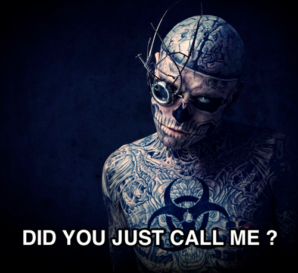

Everyone stay calm, these zombies don't mean any harm!

In Cocoa, objects released from memory will be kept around as "Zombies" if you enable a flag named `NSZombieEnabled`.

An attempt to access a freed object is a common bug in Cocoa Programming that leads to a crash. `NSZombieEnabled` helps you save a lot of time debugging your message to Zombie (released object).

When you try to call a de-allocated object with the `NSZombieEnabled` flag set, you will be notified by recording stops rather than simply crashing your application.

To enable this power move:

- Select “Edit Scheme…” from the “Product” menu (or, press Cmd+Shift+<).
- Select the “Run” on the left side of the scheme editor.
- Select the “Arguments” tab in right side page.
- Add a new item (press ‘+’) in Environment Variable and call it `NSZombieEnabled`.
- Set its value to `YES`.

Any more calls to the zombie after this will ask the system to stop the program by running a breakpoint, and you can take a look at the chain of calls that the zombie sends in the backtrack.

Learn more about it [here](https://help.apple.com/instruments/mac/current/#/dev612e6956).
