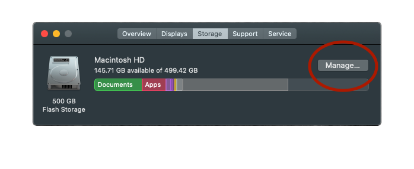

**Updated for Xcode version 14.1 on May 14, 2020 (original post was for Xcode 5).**

First of all, this post is strictly for the Apple developers using Xcode. If you're not, there's a lot of google pointers to reclaim space on your Mac. Or, try the **Manage** option in the storage section.



Apple developers, let's start by taking a note of the remaining storage space inorder to find out how much space we manage to get back.

```sh
$ df -h /

Filesystem     Size   Used  Avail Capacity iused      ifree %iused  Mounted on
/dev/disk1s5  465Gi   10Gi  152Gi     7%  487827 4876641413    0%   /

# We are mainly interested in Xcode directory, you can try any directory path.
$ du -h -d 1 ~/Library/Developer/Xcode

 47M	Library/Developer/Xcode/iOS Device Logs
 11M	Library/Developer/Xcode/Products
  0B	Library/Developer/Xcode/DocumentationCache
9.7G	Library/Developer/Xcode/iOS DeviceSupport
 17G	Library/Developer/Xcode/Archives
416K	Library/Developer/Xcode/Templates
4.3G	Library/Developer/Xcode/watchOS DeviceSupport
1.3G	Library/Developer/Xcode/UserData
8.0K	Library/Developer/Xcode/DerivedData
 32G	Library/Developer/Xcode
```

Ready?  
Here are some directory paths on your Mac allowing you to free up disk space by deleting its contents.

#### Derived data

> **~/Library/Developer/Xcode/DerivedData**

The Derived Data folder here contains all of the intermediate build information, index and debug/release built targets for your projects. Generally, you will delete this data when you observe a peculiar behavior such as improper indexing or Xcode slowness.

Deleting all content (not derived data folder itself) from the derived data directory will make all your projects recreate when you rebuild; rebuilding will be a bit slower though.

#### Archives

> **~/Library/Developer/Xcode/Archives**

All of your targets are stored in archived form in the Archives folder. Before you decide to delete the contents of this folder, here's a warning that if you want to be able to debug deployed versions of your app, you shouldn't delete the archives. Because you might need the debug symbol(.dSYM) file to re-symbolicate your crash reports.

#### DeviceSupport

> **~/Library/Developer/Xcode/iOS DeviceSupport**

iOS Device Support folder creates a subfolder with the device version as identifier when you attach the device. It's just old stuff most of the time. Keep the latest version and the rest of it can be deleted. If you don't have an app running on iOS 9.1.1, there's no reason to keep the 9.1.1 directory / directories.

If you still have a device running an older version, the directory will be re-created by Xcode when you attach the device. And, no, it has nothing to do with the simulator.

> **~/Library/Developer/Xcode/watchOS DeviceSupport**

Same goes for watchOS Device. You can remove versions of the device that you no longer use. When you connect the device again, Xcode will reload the data.


> Caution: You'll want to be careful when removing files from within `/Library` and `/Users/<yourname>/Library` as deleting the wrong files may cause applications and even the OS to misbehave.

#### CoreSimulator

> **~/Library/Developer/CoreSimulator**

The Core Simulator folder is familiar to many Xcode users. It's the territory of the simulator; that where it stores app data. It's obvious that you can delete any older version of the simulator folder(s) if you no longer support your applications for those versions.

There's a command to magically remove all the simulators that Xcode no longer requires.

```sh
xcrun simctl delete unavailable
```

And it's safer to use **Reset Content and Settings** from the menu to delete all of your app data from the simulators you're currently using.

> **Below iOS 6**: As we know, the location of the simulator has been moved from _~/Library/Application Support/iPhone Simulator_ since the Xcode 6. So, if you haven't cleared this directory, check it out.

#### Caches

> **~/Library/Caches/com.apple.dt.Xcode**

Caches are usually safe to delete because they will be recreated as necessary. This isn't a directory, it's an Xcode Project file. Delete away!

#### MobileSync Backup

> **~/Library/Application Support/MobileSync/Backup**

In addition, the Apple iOS device automatically syncs specific files and settings to your Mac every time they are connected to your Mac machine.
To be on safer side, it’s wise to use Devices pane of iTunes preferences to delete older backups; you should keep your most recent backups off course.

That's it!

<div style="width:100%;height:0;padding-bottom:75%;position:relative;"><iframe src="https://giphy.com/embed/D7T5m0AFV8Yg0" width="100%" height="100%" style="position:absolute" frameBorder="0" class="giphy-embed" allowFullScreen></iframe></div><p><a href="https://giphy.com/gifs/genius-mick-jenkins-D7T5m0AFV8Yg0">via GIPHY</a></p>

Let me know how much space has been recovered in the comments below. Also, I'd be happy to know if you've got a tip to add to the mix.
