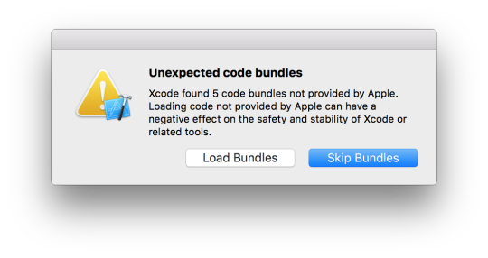

Howdy! Here’s a quick share.

After a good browsing for the Swift Code Beautifier, I found [Swimat](https://github.com/Jintin/Swimat) to be promising. However, after installing through [Alcatraz](https://github.com/alcatraz/Alcatraz), I accidentally clicked **Skip Bundles** instead of 'Load Bundles' on Xcode Relaunch.

Xcode [on re-launch] shows a **unexpected code bundles** alert when a new plug-in is identified. This way, Apple informs the user that it is not responsible for the negative effects of these third party bundles.



Well, I skipped the bundles accidentally. Duh, man!

Now, I've got to delete the plug-in property list entirely to enable it again. And, no, the re-installation of a plug-in doesn't fix the problem.

Fortunately, there's a command to fix it. Open the Terminal app and run:

```sh
# Note: Replace 7.2 with actual version of your Xcode.
defaults delete com.apple.dt.Xcode DVTPlugInManagerNonApplePlugIns-Xcode-7.2
```

Relaunch the Xcode and make sure you hit 'Load Bundles' this time.

Back to work!
