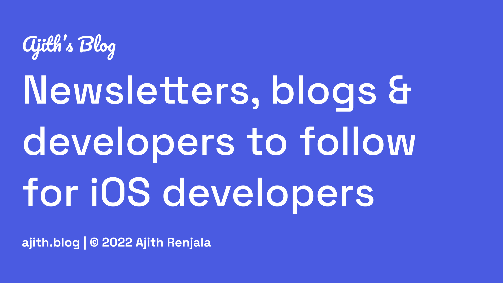

As a full-time iOS developer, everyday I’ll be [paddling](http://giphy.com/gifs/dACqNmvAfY12M/html5) towards that tight project deadline against the high winds. And, I seldom have time to stay in touch with latest trends, announcements, innovations, articles and open source inspirations surrounding iOS development. It’s difficult to stay on top of my iOS game.

Can you relate?

Fortunately, I’ve found ways to stay informed of the new happenings in realm of iOS development. Several amazing newsletters shoot an email with their findings and great stuff; subscribe them! Companies and enthusiastic developers take time to publish fantastic blogs, awesome open source libraries and regularly send out [blue](https://twitter.com/) [ravens](http://gameofthrones.wikia.com/wiki/Ravens);

**FOLLOW** them.

Here, I’ve listed Newsletters, Blogs, People, Companies and other resources that help me to keep up-to-date as an iOS and Swift developer.

##Newsletters — Curated
All the pointers neatly organized 👍.

1. **This Week In Swift** —  [https://swiftnews.curated.co](https://swiftnews.curated.co/)

   Every week Natasha Murashev puts together a list of the best Swift resources for you. Did you know she is secretly a robot? Keep reading.

2. **Indie iOS Focus Weekly** — [https://indieiosfocus.curated.co](https://indieiosfocus.curated.co)

   Looking for the best iOS dev links, tutorials, & tips beyond the usual news? Curated by Chris Beshore. I like to keep an eye on Independent iOS developers.

3. **Swift Algorithms News** —  [http://swiftalgorithms.curated.co](http://swiftalgorithms.curated.co)

   Swift Algorithms News is a curated publication full of interesting, relevant links by [Wayne Bishop](https://twitter.com/waynewbishop).

4. **iOS Dev Weekly** —  [http://iosdevweekly.com](http://iosdevweekly.com/)

   Have you started to notice that above newsletters look similar? Folks, [Dave Verwer](https://twitter.com/daveverwer) — founder of [Curated](http://curated.co) and author of iOS Dev Weekly. He puts together hand-picked round up of the best iOS development links every week. I never miss reading his comment on every issue.

5. **iOS Goodies** —  [http://ios-goodies.com](http://ios-goodies.com)

   Yet another weekly iOS newsletter curated by [Rui Peres](http://ios-goodies.com/mytwitter) and [Tiago Almeida](http://ios-goodies.com/tiagotwitter). Articles, app business, UI/UX, tools, videos and more are the goodies.

6. **Swift Monthly** —  [http://swiftmonthly.com](http://swiftmonthly.com/)

   Hand Picked Swift Tutorials, News, Videos, Jobs, Conferences and more delivered straight to your inbox. No Fuss, No Spam!

7. **Swift Developments** —  [https://andybargh.com](https://andybargh.com)

   A weekly curated email of useful links for people interested in designing and developing their own iOS, WatchOS and AppleTV apps using Swift by Andy Bargh.

8. **Swift Weekly Brief** —  [https://swiftweekly.github.io](https://swiftweekly.github.io/)

   Swift has been a game changer since introduced. It is critical to learn about disccussions surrounding the amazing open source language. So, a community driven weekly newsletter about Swift curated by [Jesse Squires](https://twitter.com/jesse_squires) helps you to get the best summary about what’s happening in the Swift open source project every week.

9. **Mobile Development Digest** —  [http://blog.alsedi.com/mobile-development-digest/](http://blog.alsedi.com/mobile-development-digest/)

   A weekly newsletter with mobile development content(90% iOS) combined from Alex D. Sergeev’s personal readings during the week.

10. **ManiacDev.Com** —  [https://maniacdev.com](https://maniacdev.com/)

    One of the first newsletters I subscribed to and it has been pointing me to hundreds of iOS App Dev Libraries, Controls, Tutorials, Examples and Tools. Great stuff, [Johann Döwa](https://twitter.com/maniacdev).

##Blogs
New posts ✨. They stay quietly in my endless reading list.

1. **Ray Wenderlich** —  [https://www.raywenderlich.com](https://www.raywenderlich.com/)

   One of the best(🏅) in the business. Quality and epic length programming tutorials (1119+ tuts). Sign up to receive the latest tutorials from Ray’s team each week.

2. **Swift Blog — Developer** —  [https://developer.apple.com/swift/blog/](https://developer.apple.com/swift/blog/)

   All the hot news about Swift published by Apple.

3. **Swift.org — Blog** —  [https://swift.org/blog/](https://swift.org/blog/)

   The swift team and the open source community making great efforts to build a better programming language for everyone.

4. **Medium — iOS App Development** —  [https://medium.com/ios-os-x-development/latest](https://medium.com/ios-os-x-development/latest)

   Stories and technical tips about building apps for iOS, Apple Watch, and iPad/iPhone. Medium is the new fad for lot of enthusiastic writers and it has also encouraged plenty of developers to start writing. I strongly recommend you to signup and start following.

5. **AppCoda** — [http://www.appcoda.com](http://www.appcoda.com/)

   [Simon Ng](https://twitter.com/simonng) (founder) and his team are on a mission to help newbies/professionals to learn iOS programming tutorials for anyone who want to pursue app development.

6. **NSHipster** — [http://nshipster.com](http://nshipster.com)

   The folks here dig into overlooked bits from Objective-C, Swift, and Cocoa. [Mattt Thompson](https://twitter.com/mattt) (I guess every iOS dev knows him) is among authors.

7. **Big Nerd Ranch’s Blog** — [https://www.bignerdranch.com/blog/categories/ios/](https://www.bignerdranch.com/blog/categories/ios/)

   The Nerd Blog! [Aaron Hillegass](https://twitter.com/AaronHillegass), a trainer and developer at NEXT co-founded it. The books written by big nerd ranch helped me big time when I started out as iOS dev.

8. **iOS-Blog** — [http://www.ios-blog.co.uk](http://www.ios-blog.co.uk)

   Swift monthly newsletter is their sister and they run a facebook page as well; check out [iPhone Application Development](https://www.facebook.com/iosblog/). Tutorials, tips, handy resource links, interview questions and jobs. so, 👍👍.

9. **Swifting.io** — [https://swifting.io](https://swifting.io)

   Post [#24](https://swifting.io/blog/2016/09/07/architecture-wars-a-new-hope/) on iOS architectures was a gem. Two iOS devs from Poland present interesting topics discovered in Swift world.

10. **iDevBlogADay** — [http://idevblogaday.com](http://idevblogaday.com)

    iOS indie developers writing every day about their stuff. Old is gold 🤘.

11. **Cocoa Is My Girlfriend** — [http://www.cimgf.com](http://www.cimgf.com)

    Experienced folks; lot to learn from ’em. I like this intro BTW.“The site is called Cocoa Is My Girlfriend because it’s about programming and a passion for programming on iOS and OSX. Writing code is hard work but it’s fun. It’s science but it’s also art. It’s fun as well as infuriating. It’s often beautiful and sometimes ugly. It’s temperamental yet rewarding. Cocoa is My Girlfriend.”

12. **Subjective-C** — [http://subjc.com](http://subjc.com)

    Subjective-C is a study of innovative iOS interfaces Written by [Sam Page](http://twitter.com/sampage/) and [Matt Delves](http://twitter.com/mattdelves/). Check that out!

13. **iOS Developer Tips** —  [http://iosdevelopertips.com](http://iosdevelopertips.com)

    John Muchow a long time iOS developer shares tips that are focused on all things iOS developer centric, from APIs and tools to coding tips, tricks and best practices.

14. **iOS Dev Nuggets** —  [http://hboon.com/iosdevnuggets/](http://hboon.com/iosdevnuggets/)

    Short, and usually something you can read in a few minutes and improve your skills at iOS app development shot right into your inbox by [Hwee-Boon Yar](https://twitter.com/hboon).

15. **That thing in swift** — [https://thatthinginswift.com](https://thatthinginswift.com)

    “What are the things I should know if I want to develop with Swift?” is your question? Checkout Nick O’Neill’s that thing in Swift blog.

##Fellow Developers I Follow
Gratitude. They helps us code better. 👏👏.

1. **NatashaTheRobot** | **Natasha Murashev**

   🔗 : [https://www.natashatherobot.com](https://www.natashatherobot.com)

   🐥 : [http://twitter.com/natashatherobot](http://twitter.com/natashatherobot)

2. **Ash Furrow**

   🔗 : [https://ashfurrow.com](https://ashfurrow.com)

   🐥 : [https://twitter.com/ashfurrow](https://twitter.com/ashfurrow)

3. **Use Your Loaf** | **K Harrison**

   🔗 : [http://useyourloaf.com](http://useyourloaf.com)

   🐥 : [https://twitter.com/kharrison](https://twitter.com/kharrison)

4. **Sam Soffes**

   🔗 : [https://soff.es](https://soff.es)

   🐥 : [https://twitter.com/soffes](https://twitter.com/soffes)

5. **Ole Begemann**

   🔗 : [https://oleb.net](https://oleb.net)

   🐥 : [https://twitter.com/olebegemann](https://twitter.com/olebegemann)

6. **Erica Sadun**

   🔗 : [http://ericasadun.com](http://ericasadun.com)

   🐥 : [https://twitter.com/ericasadun](https://twitter.com/ericasadun)

7. **Chris Eidhof**

   🔗 : [http://www.eidhof.nl](http://www.eidhof.nl)

   🐥 : [https://twitter.com/chriseidhof/](https://twitter.com/chriseidhof/)

8. **Nick Lockwood**

   🐥 : [https://twitter.com/nicklockwood](https://twitter.com/nicklockwood)

9. **Mathew Sanders**

   🔗 : [http://mathewsanders.com](http://mathewsanders.com)

   🐥 : [https://twitter.com/mathewsanders](https://twitter.com/mathewsanders)

10. **Soroush Khanlou**

    🔗 : [http://khanlou.com](http://khanlou.com)

    🐥 : [https://twitter.com/khanlou](https://twitter.com/khanlou)

11. **The.Swift.Dev.** | **Tibor Bodecs**

    🔗 : [https://theswiftdev.com](https://theswiftdev.com)

    🐥 : [https://twitter.com/tiborbodecs](https://twitter.com/tiborbodecs)

12. **Think and Build** | **Yari D’areglia**

    🔗 : [http://www.thinkandbuild.it](http://www.thinkandbuild.it)

    🐥 : [https://twitter.com/bitwaker](https://twitter.com/bitwaker)

13. **Cocoa with Love** | **Matt Gallagher**

    🔗 : [http://www.cocoawithlove.com](http://www.cocoawithlove.com)

    🐥 : [https://twitter.com/cocoawithlove](https://twitter.com/cocoawithlove)

14. **Jameson Quave**

    🔗 : [http://jamesonquave.com/blog/](http://jamesonquave.com/blog/)

    🐥 : [https://twitter.com/jquave](https://twitter.com/jquave)

15. **Krakendev** | **Hector Matos**

    🔗 : [http://krakendev.io](http://krakendev.io)

    🐥 : [https://twitter.com/allonsykraken](https://twitter.com/allonsykraken)

16. **Peter Steinberger**

    🔗 : [http://petersteinberger.com](http://petersteinberger.com)

    🐥 : [https://twitter.com/steipete](https://twitter.com/steipete)

17. **Sam Davies**

    🔗 : [http://iwantmyreal.name](http://iwantmyreal.name)

    🐥 : [https://twitter.com/iwantmyrealname](https://twitter.com/iwantmyrealname)

18. **Radek Pietruszewski**

    🔗 : [http://radex.io](http://radex.io)

    🐥 : [https://twitter.com/radexp](https://twitter.com/radexp)

19. **Rob Napier**

    🔗 : [http://robnapier.net](http://robnapier.net)

    🐥 : [https://twitter.com/cocoaphony](https://twitter.com/cocoaphony)

20. **Matt Blair**

    🔗 : [https://mattblair.net](https://mattblair.net)

    🐥 : [https://twitter.com/elsewisemedia](https://twitter.com/elsewisemedia)

21. **Javier Soto**

    🔗 : [http://www.javiersoto.me](http://www.javiersoto.me)

    🐥 : [https://twitter.com/Javi](https://twitter.com/Javi)

22. **Andy Matuschak**

    🔗 : [https://andymatuschak.org](https://andymatuschak.org)

    🐥 : [https://twitter.com/andy_matuschak](https://twitter.com/andy_matuschak)

23. **Ben Sandofsky**

    🔗 : [https://sandofsky.com](https://sandofsky.com)

    🐥 : [https://twitter.com/sandofsky](https://twitter.com/sandofsky)

24. **Jesse Squires**

    🔗 : [http://www.jessesquires.com](http://www.jessesquires.com)

    🐥 : [https://twitter.com/jesse_squires](https://twitter.com/jesse_squires)

25. **Justin Spahr-Summers**

    🔗 : [http://jspahrsummers.com](http://jspahrsummers.com)

    🐥 : [https://twitter.com/jspahrsummers](https://twitter.com/jspahrsummers)

26. **Krzysztof Zabłocki**

    🔗 : [http://merowing.info](http://merowing.info)

    🐥 : [https://twitter.com/merowing\_](https://twitter.com/merowing_)

27. **Brian Gesiak**

    🔗 : [http://modocache.io](http://modocache.io)

    🐥 : [https://twitter.com/modocache](https://twitter.com/modocache)

28. **Ryan Nystrom**

    🔗 : [http://whoisryannystrom.com](http://whoisryannystrom.com)

    🐥 : [https://twitter.com/\_ryannystrom](https://twitter.com/_ryannystrom)

29. **Matt Galloway**

    🔗 : [http://www.galloway.me.uk](http://www.galloway.me.uk)

    🐥 : [https://twitter.com/mattjgalloway](https://twitter.com/mattjgalloway)

30. **James Frost**

    🔗 : [http://jamesfrost.co.uk](http://jamesfrost.co.uk)

    🐥 : [https://twitter.com/frosty](https://twitter.com/frosty)

31. **Matt Reagan**

    🔗 : [http://sound-of-silence.com](http://sound-of-silence.com)

    🐥 : [https://twitter.com/hmblebee](https://twitter.com/hmblebee)

32. **Clean Swift** | **Raymond Law**

    🔗 : [http://clean-swift.com/](http://clean-swift.com/)

    🐥 : [https://twitter.com/rayvinly](https://twitter.com/rayvinly)

33. **Marco Arment**

    🔗 : [https://marco.org](https://marco.org)

    🐥 : [https://twitter.com/marcoarment](https://twitter.com/marcoarment)

34. **Orta Therox**

    🔗 : [http://orta.io](http://orta.io)

    🐥 : [https://twitter.com/orta](https://twitter.com/orta)

35. **Nate Cook**

    🔗 : [http://natecook.com](http://natecook.com)

    🐥 : [https://twitter.com/nnnnnnnn](https://twitter.com/nnnnnnnn)

36. **JP Simard**

    🔗 : [http://www.jpsim.com](http://www.jpsim.com)

    🐥 : [https://twitter.com/simjp](https://twitter.com/simjp)

37. **Hacking with Swift** | **Paul Hudson**

    🔗 : [https://www.hackingwithswift.com](https://www.hackingwithswift.com)

    🐥 : [https://twitter.com/twostraws](https://twitter.com/twostraws)

38. **John Gruber**

    🔗 : [http://daringfireball.net](http://daringfireball.net)

    🐥 : [https://twitter.com/gruber](https://twitter.com/gruber)

39. **Steve Streza**

    🔗 : [http://stevestreza.com](http://stevestreza.com)

    🐥 : [https://twitter.com/SteveStreza](https://twitter.com/SteveStreza)

40. **Swift Unboxed** | **Greg Heo**

    🔗 : [https://gregheo.com](https://gregheo.com)

    🐥 : [https://twitter.com/gregheo](https://twitter.com/gregheo)

41. **Dan Counsell**

    🔗 : [https://www.dancounsell.com](https://www.dancounsell.com)

    🐥 : [https://twitter.com/dancounsell](https://twitter.com/dancounsell)

42. **Ellen Shapiro**

    🔗 : [http://designatednerd.com](http://designatednerd.com)

    🐥 : [https://twitter.com/designatednerd](https://twitter.com/designatednerd)

43. **Learn Swift** | **Ayaka Nonaka**

    🔗 : [http://www.ayaka.me](http://www.ayaka.me)

    🐥 : [https://twitter.com/ayanonagon](https://twitter.com/ayanonagon)

44. **Curtis Herbert**

    🔗 : [https://blog.curtisherbert.com](https://blog.curtisherbert.com)

    🐥 : [https://twitter.com/parrots](https://twitter.com/parrots)

45. **Chris Lattner**

    🔗 : [http://nondot.org/sabre/](http://nondot.org/sabre/)

    🐥 : [https://twitter.com/clattner_llvm](https://twitter.com/clattner_llvm)

##Curated Collections
A similar version of this post 🍻.

1. **LearnSwift.tips** — [http://www.learnswift.tips](http://www.learnswift.tips)

   A curated list of helpful resources to learn Swift. Tutorials, Code Samples, References and more!

2. **Cocoa Controls** — [https://www.cocoacontrols.com](https://www.cocoacontrols.com/)

   4000+ open source UI components.

3. **iOS Cookies** — [http://www.ioscookies.com](http://www.ioscookies.com)

   A hand curated collection of iOS libraries written in Swift.

4. **iOS Stack** — [http://iosstack.com](http://iosstack.com)

   iOSStack is a hand-curated collection of links and resources for iOS.

5. **App Dev Wiki** — [http://appdevwiki.com/wiki/show/HomePage](http://appdevwiki.com/wiki/show/HomePage)

   It’s meant to collect links, tools, libraries, and anything that is useful for mobile development.

##Companies that OSS
Amazing culture 🎉.

1. **Realm**

   🔗 : [https://realm.io/news/](https://realm.io/news/)

   🐙 : [https://github.com/realm](https://github.com/realm)

   🐥 : [https://twitter.com/realm](https://twitter.com/realm)

2. **Artsy**

   🔗 : [http://artsy.github.io](http://artsy.github.io)

   🐙 : [https://github.com/artsy](https://github.com/artsy)

   🐥 : [https://twitter.com/artsyopensource](https://twitter.com/artsyopensource)

3. **Ramotion**

   🐙 : [https://github.com/Ramotion](https://github.com/Ramotion)

   🐥 : [https://twitter.com/ramotion](https://twitter.com/ramotion)

4. **Yalantis**

   🐙 : [https://github.com/Yalantis](https://github.com/Yalantis)

   🐥 : [https://twitter.com/yalantis](https://twitter.com/yalantis)

5. **Hyper**

   🐙 : [https://github.com/hyperoslo](https://github.com/hyperoslo)

   🐥 : [https://twitter.com/hyperoslo](https://twitter.com/hyperoslo)

6. **Raizlabs**

   🔗 : [https://www.raizlabs.com/dev/category/ios/](https://www.raizlabs.com/dev/category/ios/)

   🐙 : [https://github.com/Raizlabs](https://github.com/Raizlabs)

   🐥 : [https://twitter.com/raizlabs](https://twitter.com/raizlabs)

7. **Thoughtbot**

   🔗 : [https://robots.thoughtbot.com/ios](https://robots.thoughtbot.com/ios)

   🐙 : [https://github.com/thoughtbot](https://github.com/thoughtbot)

   🐥 : [https://twitter.com/thoughtbot](https://twitter.com/thoughtbot)

8. **Invasivecode**

   🔗 : [https://www.invasivecode.com/weblog/](https://www.invasivecode.com/weblog/)

   🐥 : [https://twitter.com/invasivecode](https://twitter.com/invasivecode)

9. **Cocoanetics**

   🔗 : [https://www.cocoanetics.com](https://www.cocoanetics.com)

   🐙 : [https://github.com/cocoanetics](https://github.com/cocoanetics)

   🐥 : [https://twitter.com/cocoanetics](https://twitter.com/cocoanetics)

10. **Y Media Labs** \*cough cough I work here..😉

    🔗 : [https://medium.com/ymedialabs-innovation](https://medium.com/ymedialabs-innovation)

    🐥 : [https://twitter.com/ymedialabs](https://twitter.com/ymedialabs)

##Inspirations
Design is pivotal.

1. **Pttrns** — [http://pttrns.com/ios-patterns](http://pttrns.com/ios-patterns)

   The finest collection of design patterns, resources and inspiration a.k.a The mother of all design resources.

2. **Mobile Patterns** —  [http://www.mobile-patterns.com](http://www.mobile-patterns.com)
3. **User Your Interfaces** — [http://uyi.io](http://uyi.io)

   Use Your Interface is an inspiration resource for designers and developers.

4. **CAPPTIVATE** — [http://capptivate.co](http://capptivate.co)

   A kinetic pattern library that captures and preserves delightful iOS animations. Created by [Alli Dryer](https://medium.com/@allidryer?source=post_header_lockup), a designer at Twitter.

5. **Lovely UI** — [http://www.lovelyui.com](http://www.lovelyui.com)

   A Collection of Mobile UI Elements.

6. **app.itize.us** — [http://app.itize.us](http://app.itize.us)

   A painstakingly curated presentation of the best designed apps available.

7. **Beautiful Pixels** — [http://beautifulpixels.com](http://beautifulpixels.com)

   Beautiful Pixels is a place where we can collectively admire the works of some of the greatest user interface designs of our time.

8. **Landingfolio** — [http://www.landingfolio.com](http://www.landingfolio.com)

   Only the best landing page design inspirations.

9. **Dribbble** — [https://dribbble.com](https://dribbble.com)

   Developers have been trying out animations posted here from designers.

10. **Clark from Invision** — [http://blog.invisionapp.com](http://blog.invisionapp.com)

    Nothing more to explain about this dude; [check this out](https://twitter.com/hashtag/clarkfrominvision?src=hash).

##Talks, Screencasts & Videos

1. **WWDC**— [https://developer.apple.com/videos/wwdc2016/](https://developer.apple.com/videos/wwdc2016/)

   The best 🏆. Period.

2. **Objc.io-Swift Talk** — [https://www.objc.io](https://www.objc.io)

   Don’t forget to checkout their 24 issues; discontinued, nevertheless extremely helpful.

3. **NSScreencast** — [http://nsscreencast.com/](http://nsscreencast.com/episodes)

   Weekly bite-sized screencasts on iOS development by [Ben Scheirman](https://twitter.com/subdigital).

4. **Ray Wenderlich** — [https://videos.raywenderlich.com](https://videos.raywenderlich.com)

   Yes, again. Over 150 videos diving deep into all aspects of Swift & iOS development.

5. **Stanford** | **Paul hegarty** — [https://itunes.apple.com/us/course/developing-ios-8-apps-swift/id961180099](https://itunes.apple.com/us/course/developing-ios-8-apps-swift/id961180099)

   Beginner 👶🏻? I strongly recommend this course.

##Awesomeness
Finally, have you ever searched for “**Awesome**” on Github?  
(Each entry below is in incremental order of being awesome)

1. **Awesome iOS** — [http://awesomeios.com](http://awesomeios.com)

   A curated list of awesome iOS ecosystem, including Objective-C and Swift Projects.

2. **iOS Top 1000** — [https://github.com/iamdaiyuan/ios_top_1000](https://github.com/iamdaiyuan/ios_top_1000)

   A curated list of awesome iOS top 1000 libraries.

3. **Awesome Awesomeness** — [https://github.com/bayandin/awesome-awesomeness](https://github.com/bayandin/awesome-awesomeness)

   A curated list of awesome awesomeness.

4. **Awesome** — [https://awesome.re](https://awesome.re/)

   Curated list of awesome lists. 😎.

##Fun
Humor Me 😆.

1. **This Dot Programmer** —[http://thisdotprogrammer.com](http://thisdotprogrammer.com)
2. **The Coding Love** — [http://thecodinglove.com](http://thecodinglove.com)
3. **Dilbert** — [http://dilbert.com](http://dilbert.com)

..  
.

🎤👋

  
This post was originally [published](https://medium.com/@ajithrnayak/stayin-on-top-of-your-game-ios-newsletters-blogs-developers-companies-to-follow-527b859b3bb5) on Medium.
