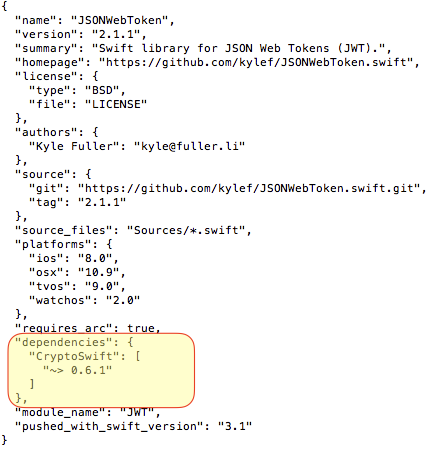

Xcode 9 was announced at WWDC17 with several big [changes](https://developer.apple.com/library/archive/documentation/DeveloperTools/Conceptual/WhatsNewXcode/xcode_9/xcode_9.html). And, because of the quicker build times, I couldn't resist using it. It's a bold move!

However, because the following pod was not compatible with Xcode 9 's Swift compiler, I ran into bunch of compilation errors.

> pod ‘CryptoSwift’

Now, I knew which Pod was not compatible, but I couldn't find any mention of the particular Pod in the Podfile of my project. So, how do I determine which Pod(s) are dependent on CryptoSwift.

###### Determine dependent Pods of a particular Pod

The easiest way I found to determine which third-party library uses the erroneous Pod was to go through the dependency information of each Pod used in the project.

Here's the command to output the contents of the podspec for a Pod. It prints the content of the podspec(s) whose name matches QUERY to standard output. You can learn more about this in the [CocoaPods Command-line Reference](https://guides.cocoapods.org/terminal/commands.html#pod_spec_cat) section.

```sh
pod spec cat [QUERY]
```

So, after scanning a few potential pods, the pod that needed an update was JSONWebToken. Saved some time by not going through any unrelated pods.

Let's navigate to project directory and run following command:

```sh
pod spec cat JSONWebToken
```

Now, look up the 'dependencies' information in output. 



That's how I found the dependant Pod in my project. Let me know if the trick is easier.
