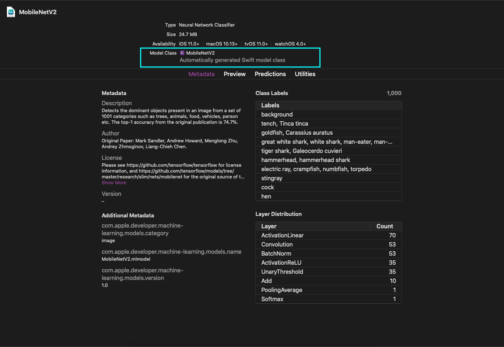

Our goal is to build a simple implementation of image recognition. To achieve this, we will use the [Vision Framework](https://developer.apple.com/documentation/vision), which was introduced in iOS 11 to apply computer vision algorithms to perform a variety of tasks on input images and video.

Our implementation will use the Vision APIs to pre-process the input image. We will, however, need a trained machine learning model to identify the image. So, we will also use the [Core ML](https://developer.apple.com/documentation/coreml) framework to integrate models that make predictions of what the input image is.

## Integrate machine learning models

The model is the result of the application of a machine learning algorithm to a training data set. There are [several open source models](https://developer.apple.com/machine-learning/models/) available for classification on developer site. For this implementation, we will use
`MobileNetV2` or `Resnet50`.

1. Download the models [MobileNetV2](https://ml-assets.apple.com/coreml/models/Image/ImageClassification/MobileNetV2/MobileNetV2.mlmodel) and [Resnet50](https://ml-assets.apple.com/coreml/models/Image/ImageClassification/Resnet50/Resnet50.mlmodel).
2. Once you obtain your model, drag and drop it into Xcode.
3. Xcode will automatically generate the necessary classes, providing you an interface to interact with your model.
4. Notice the automatically generated Swift model class name.



Let’s write the code that will list the models available in our project. This should enable us to swap between models in the future with ease.

```swift
import CoreML

enum CoreMLModelFile: String {
    case mobileNetV2    = "MobileNetV2"
    case resnet50       = "Resnet50"

    func getModel() throws -> MLModel {
        // use model default configurations
        let config = MLModelConfiguration()
        switch self {
        case .mobileNetV2:
            return try MobileNetV2(configuration: config).model
        case .resnet50:
            return try Resnet50(configuration: config).model
        }
    }
}
```

## Create a Vision request using the model

Let's start by creating a reusable worker class in our project called `VisionMLWorker`. Then, we initialize it with a `CoreMLModelFile` to create a `VNCoreMLModel` which is basically a wrapper provided by Vision framework for CoreML model.

```swift
class VisionMLWorker {
    let coreModel: VNCoreMLModel
    private(set) var classificationRequest: VNCoreMLRequest?

    // MARK: - Initializer

    init(modelFile: CoreMLModelFile) throws {
        do {
            let model       = try modelFile.getModel()
            let coreModel   = try VNCoreMLModel(for: model)
            self.coreModel  = coreModel
        }
        catch {
            print("Failed to load Vision ML model: \(error)")
            throw VisionMLClassificationError.invalidModelFile
        }
    }
}
```

Yes, we haven't defined errors for our image recognition implementation. Let's add the following custom error just above VisionMLWorker class declaration in the same file.

```swift
enum VisionMLClassificationError: Error {
    case invalidModelFile
    case invalidImageFile
    case classificationFailed
}
```

Let's then use the model to create the object `VNCoreMLRequest`. Use the completion handler for the request object to specify the method for receiving the results after you run the request.

We shall implement the logic to process the results of the classification in a moment.

```swift
   /// Create a classification request based on model file
func setupClassificationRequest() {
    let coreModel = self.coreModel
    let request = VNCoreMLRequest(model: coreModel) { [weak self] request, error in
        self?.processClassifications(for: request, error: error)
    }
    request.imageCropAndScaleOption = .centerCrop
    self.classificationRequest = request
}

private func processClassifications(for request: VNRequest, error: Error?) {
    // todo: handle request.results or any error
}
```

## Perform image analysis

We are now at the final part of this puzzle. Before we run the perform analysis operation on the `classificationRequest`, let's define our approach to handle the results.

To the top of the file, add the following code. A `ClassificationData` has identifier string and the confidence level on the prediction.

```swift
struct ClassificationData {
    let identifier: String
    let confidence: Double
}

typealias ClassificationCompletionHandler = (([ClassificationData]) -> Void)
```

Also, add a property to `VisionMLWorker` for completion handler that gets invoked in `processClassifications(for:error:)`.

```swift
var completionHandler: ClassificationCompletionHandler? = nil
```
<br/>
Let's take the image to be processed, and create a `VNImageRequestHandler` object. then, on a background queue, run the vision model request asynchronously.

> Most models are trained on images that are already oriented correctly for display. To ensure proper handling of input images with arbitrary orientations, pass the image’s orientation to the image request handler.

```swift
func getClassifications(for image: UIImage,
                        completionHandler: @escaping ClassificationCompletionHandler) throws {

    guard let classificationRequest = self.classificationRequest else {
        print("Failed to perform classification.")
        throw VisionMLClassificationError.classificationFailed
    }

    // remember completion handler for later
    self.completionHandler = completionHandler

    // feed the orientation information since CGImage can't read UIImage orientation
    let imageOrientation = image.imageOrientation.rawValue
    guard let orientation = CGImagePropertyOrientation(rawValue: UInt32(imageOrientation)),
          let ciImage = CIImage(image: image) else {
        print("Unable to create \(CIImage.self) from \(image).")
        throw VisionMLClassificationError.invalidImageFile
    }

    DispatchQueue.global(qos: .userInitiated).async {
        let handler = VNImageRequestHandler(ciImage: ciImage,
                                            orientation: orientation)
        do {
            try handler.perform([classificationRequest])
        }
        catch {
            // check VNCoreMLRequest's completion block for detailed error
            print("Failed to perform classification.\n\(error.localizedDescription)")
        }
    }
}
```

## Handle Image Classification Results

Lastly, let's go back and handle the unfinished implementation of completion handler for classification results.

The completion handler of the Vision request indicates whether the request was successful or resulted in an error. If successful, its results property includes `VNClassificationObservation` objects describing possible classifications identified by the ML model.

```swift
private func processClassifications(for request: VNRequest, error: Error?) {
    guard let results = request.results,
          let classifications = results as? [VNClassificationObservation],
          !classifications.isEmpty else {
        print("Unable to classify image.\n\(String(describing: error?.localizedDescription))")
        return
    }

    /// limit classification results count to 2 instead of 1000.
    let firstClassifications = classifications.prefix(2)
    var requestedClassifications = [ClassificationData]()
    firstClassifications.forEach { (observation) in
        let data = ClassificationData(identifier: observation.identifier,
                                      confidence: Double(observation.confidence))
        requestedClassifications.append(data)
    }
    print("Fetched requested classifications: \(requestedClassifications)")
    completionHandler?(requestedClassifications)
}
```

## Usage example

Now that your `VisionMLWorker` is ready for use, you could do the following to perform classification analysis on a image.

```swift
let image = UIImage(named: "banana-img")
// prepare core ML request
guard let visionWorker = try? VisionMLWorker(modelFile: .resnet50) else {
    return
}
visionWorker.setupClassificationRequest()
// process image async
do {
    try self.visionWorker.getClassifications(for: image) { (results) in
        DispatchQueue.main.async { [weak self] in
            // update the UILabel or something..
        }
    }
}
catch {
    // handle errors appropriately.
}
```
<br/>
That's all you need to identify an image using 1000 classification categories. Go ahead give it a try and play around with different Core ML models.

You can download the completed sample project from [GitHub here](https://github.com/ajithrnayak/RemindMe).
