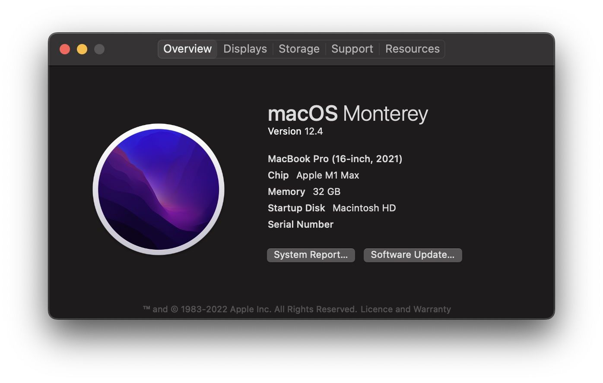

I got a new Macbook and I'm about to set it up for work. As developers, we have all been there. Oftentimes, when we switch to new jobs. And, this is my quick step-by-step guide to setup a mac for development.

#### What have I got? 
My employer acknowledged the [productivity boost](https://doordash.engineering/2022/03/01/why-apples-new-m1-chips-are-essential-for-rapid-ios-development/) that all iOS developers are experiencing on their Apple Silicon Macs and decided to invest in developer productivity. 
So I got a brand new Macbook Pro with an Apple M1 Max chip. :tada:



#### Setup Mission Control

During WWDC'22, Apple announced its new [Stage Manager](https://9to5mac.com/2022/06/29/stage-manager-on-mac/) feature on Macs, but long before that, I found managing or focusing on tasks and switching between apps/windows to be quite stressful. So, by utilising the existing features, namely Hot Corners and virtual desktops, I've grown quite accustomed to my setup. That's why, on every Mac I've used in the last decade, I've always started by configuring hot corners and a couple of virtual desktops with keyboard shortcuts.


#### Know your shell

To determine the POSIX-compliant shell (sh, dash, ksh, zsh, bash), type

```bash
echo $SHELL
```

To check your homefolder, open Terminal app and type

```bash
pwd
# or
echo $HOME
```

#### Install Xcode

As an [Apple developer](https://twitter.com/ajithrnayak/status/1534043431122927616), latest version of Xcode is pretty much everything I need. However, I will occasionally require beta builds or even older versions for a legacy codebase. 

Xcode can be downloaded from [Developer/Downloads](https://developer.apple.com/download/) or the Mac App Store. However, friends do not allow friends to download Xcode from the App Store. So, I will use the easiest way to install and switch between multiple versions of Xcode - [Xcodes App](https://github.com/RobotsAndPencils/XcodesApp).


###### Apply Xcode Theme

I'm going to install a [few programming-focused fonts](https://twitter.com/ajithrnayak/status/1543923287993921538) before applying my one and only preferred Xcode theme. 

Dusk theme + Hermit Font = 💞

For my custom themes, I keep a [open-source repo](https://github.com/ajithrnayak/xcode-themes). Let's follow the repo's instructions! 

And, if you want to give it a shot, go ahead!

#### Communication

While Xcode is being installed, it's time to setup team communication apps and configure email client. 


#### Install Homebrew

I work on web projects on occasion, and prior to Swift Package Manager, Cocoapods was my go-to dependency manager for all of my projects. To manage these packages, I'll be using [Homebrew](https://brew.sh) - The Missing Package Manager for macOS. 

```bash
/bin/bash -c "$(curl -fsSL https://raw.githubusercontent.com/Homebrew/install/HEAD/install.sh)"
```

#### Configure Git

Open terminal and input these (replace your name and email)

```bash
# configure git user details
git config --global user.name "John Doe"
git config --global user.email "john.doe@gmail.com"
```

A Mac has some annoying files that can be ignored by git. Let's add them,

```bash
nano ~/.gitignore
```

Then add these (compare against the latest [here](https://github.com/github/gitignore/blob/main/Swift.gitignore))

```git
# Mac
.DS_Store
.AppleDouble
.LSOverride

# Thumbnails
._*

# Files that might appear in the root of a volume
.DocumentRevisions-V100
.fseventsd
.Spotlight-V100
.TemporaryItems
.Trashes
.VolumeIcon.icns
.com.apple.timemachine.donotpresent

# Directories potentially created on remote AFP share
.AppleDB
.AppleDesktop
Network Trash Folder
Temporary Items
.apdisk

# Windows
Thumbs.db

# WebStorm
.idea/

# Node
npm-debug.log
```

After you are done, activate this globally by running

```bash
git config --global core.excludesfile ~/.gitignore
```

#### Show Hidden Files

I find it very useful to have all of the hidden files always visible. Apple may have hidden them to prevent users from fiddling with and corrupting the Mac itself, but having certain hidden configuration files and directories viewable in project environment is rather convenient for developers.

```bash
defaults write com.apple.Finder AppleShowAllFiles TRUE;killall Finder
```

#### Setup SSH Keys

We will generate and configure Secure Shell Protocol (SSH) keys in order to establish a secure connection with development environments such as Github and Gitlab. 

To achieve this, I prefer to use [Github's guide](https://docs.github.com/en/authentication/connecting-to-github-with-ssh).

#### Install Dev Tools & more.. 

Up next, allow me to install a few of development tools that I use frequently and in almost every project.

[**Visual Studio Code**](https://code.visualstudio.com)
This is by far the best code editor I've ever used. It does so many things the right way. I'm always impressed by the user experience. 

**[Sourcetree](https://www.sourcetreeapp.com)**
A free (though it shouldn't be) Git client for Mac that I'm very familiar with.  

**[Postman](https://www.postman.com)**
API lifecycle management tool that is widely used. Built with pride in 🇮🇳. 

**[Typora](https://typora.io)**
If I'm blogging anything, I use this seamless markdown editor.

**[Slash](https://getslash.co)** 
Because of its simplicity, I mostly use Apple's Notes app for task management. I like to keep a daily schedule, and the Slash app works best for me. I was able to replicate what worked with Notes in this app.

**[Dato](https://sindresorhus.com/dato)**
This is actually a better menu bar clock with calendar and time zones.

**[Spotify](http://spotify.com)**
I have an Apple Music subscription, but Spotify's music discovery is simply amazing.

#### Install Cocoapods

CocoaPods is a package manager for iOS development. It is built with Ruby and is installable with the default Ruby available on macOS. Default ruby is recommended.

```bash
# Using Homebrew
brew install cocoapods

# Alternatively using RubyGems
sudo gem install cocoapods
```

#### Install Fastlane

An easiest way to automate beta deployments and releases for your iOS and Android apps.

```bash
# Using Homebrew
brew install fastlane

# Alternatively using RubyGems
sudo gem install fastlane -NV
```

#### Install Node

Open Terminal and run following command

```bash
brew install node    # this will install latest
# or
nvm install node    # this will install latest
# or
nvm install 10.1    # this will install version 10.1
```

Or, download the latest Node.js version from [the official Node.js website](https://nodejs.org/en/), double click on the downloaded file and go through the installation process.

To confirm that this worked, you can run `npm --version` and `node --version`.

#### Install Gatsby CLI

The Gatsby command line interface (CLI) is a tool that let's me quickly run commands for developing this very own blogging website which is [built using Gatsby](https://github.com/ajithrnayak/ajith_blog/).

```bash
npm install -g gatsby-cli
```

#### Install Figma

I'm an aspiring designer who is constantly learning, sketching, and prototyping my concepts on Figma. So, allow me to install the fantastic design tool Figma.


#### Missing Fonts?

In my designs, I use custom fonts, the majority of which are Google fonts. Instead of installing those fonts one by one, let's use this [easy command](https://github.com/qrpike/Web-Font-Load) to install all of Google's Web Fonts.

```bash
curl https://raw.githubusercontent.com/qrpike/Web-Font-Load/master/install.sh | bash
```

#### Ta-da

Done!
<div style="width:100%;height:0;padding-bottom:56%;position:relative;"><iframe src="https://giphy.com/embed/l3V0zw9pxoZxttxHa" width="100%" height="100%" style="position:absolute" frameBorder="0" class="giphy-embed" allowFullScreen></iframe></div><p><a href="https://giphy.com/gifs/cbc-funny-comedy-mr-d-l3V0zw9pxoZxttxHa">via GIPHY</a></p>
That will do for now to set up my development environment on a macOS.

Happy Coding!
