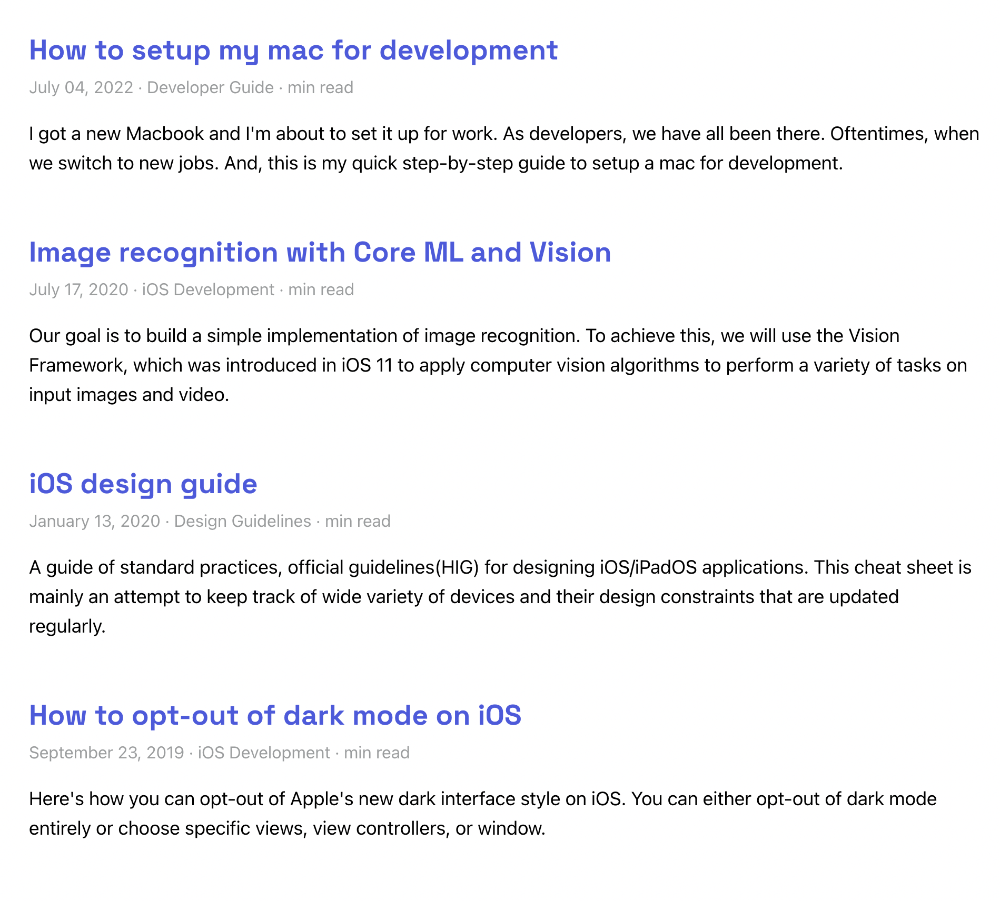
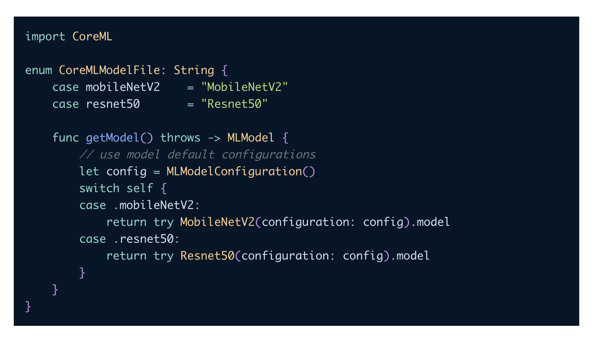

During the early stages of my career as an iOS developer, I began blogging on Wordpress and later on Tumblr. 
Eventually, despite being overwhelmed (and frankly discouraged) by the number of tools and technologies available in web development,  I [built a dev blog](https://twitter.com/ajithrnayak/status/1265977715846307840) for myself using Gatsby. 

#### Why Gatsby?

To be honest, I chose it simply because it was popular at the time. I noticed a number of developers I follow on Twitter discussing it. And Gatsby's documentation was actually quite convincing and easier to follow.  As a mobile developer, getting exposure to other platforms such as web was my main objective. So, without much thought, I built a blog that I was happy with.

#### Why Migrate to Next.js?

 I recently came across this blog post about [Migrating from Gatsby](https://nextjs.org/docs/migrating/from-gatsby), which sparked my curiosity in the technical advantages and similarities.

If you haven't already noticed, my blog and websites are two separate projects. I wanted the blog to be primarily about content publishing, while my creative ideas would be expressed on the portfolio website. In fact, both are like playgrounds for experiments and fun. Since I have a weekend for myself, why not try migrating to Next.js and see how it goes?

Nextjs appears to have a much larger developer community, and it also claims to be the most developer-friendly react framework for building production apps. So, this migration idea should be an excellent way for me to become acquainted. 

My goal here is not to make any visual or content changes. And I certainly don't want to jeopardise current SEO rankings. To be honest, I'm not sure about replacing the existing blog right away unless I can replicate all of the features within the timeframe available. 

Anyway, let's dive in and experiment for the sheer joy of learning something new.

#### First Roadblock

Although I appreciate the [Migrating from Gatsby](https://nextjs.org/docs/migrating/from-gatsby) documentation, it led to more new browser tabs and little direction for what I was trying to achieve.

Instead, I decided to start with a clean slate and simply copy over content from the existing Gatsby project as needed. 

Let's try the preferred method for launching a new Nextjs project:

```bash
npx create-next-app ajith_blog_v2 --use-npm
```

I can verify that the basic setup was successfully generated by running 'npm run dev' and then visiting http://localhost:3000/.

#### The Stack

This blog would be a [Next.js](https://nextjs.org/) application. 

Blog posts are markdown files, and I'll parse them using [gray-matter](https://github.com/jonschlinkert/gray-matter). Of course, I'd like to add custom React components in the future, and I'm considering MDX for that, but for now, I'm content with just Markdown. 

This should allow me to choose static site generation, which means that all of the blog posts will be built ahead of time when the site is generated.

When it comes to styling, I plan to keep things simple and avoid using any cosmetic libraries. 

I've been hosting the blog on Netlify, and because this repository will also be open-sourced on Github, similar to the [Gatsby version](https://github.com/ajithrnayak/ajith_blog), Netlify's new pricing strategy will most likely have no effect.

#### Step 1: Data Fetching

The blog posts are simply Markdown files with associated images stored in the same directory. We will copy over all of the files from `content/posts` while keeping the same directory name and structure. 

I make use of 'frontmatter' on my blog. Using the Markdown add-on frontmatter, we can define key-value pairs at the beginning of the document. 

This is how the post looks:

```markdown
---
title: "How to setup my mac for development"
date: "2022-07-04T00:00:00.000Z"
draft: false
path: "/set-up-dev-env-on-macOS"
category: "Guide"
tag: "Developer Guide"
coverImage:
    src: "./blog_cover.png"
    alt: "Blog Cover Image"
excerpt: "I got a new Macbook and I'm about to set it up for work. As developers, we have all been there. Oftentimes, when we switch to new jobs. And, this is my quick step-by-step guide to setup a mac for development."
---

(Actual blog content goes here...)
```


Gatsby queries local data, remote data, or site configuration information using GraphQL. For reading and handling markdown files, Gatsby offered plugins. However, Nextjs allows users to read from the file system using the native Node.js 'fs' package rather than abstracting it to a plugin.

And to parse content from a loaded markdown file, install the 'gray-matter' library. 

```bash
npm install --save gray-matter
```

Now we're going to make a file called `lib/posts.js` that will load and parse all of the blog post markdown files:

```js
// src/lib/posts.js

import matter from 'gray-matter'
import { parseISO, format } from 'date-fns'
import fs from 'fs'
import { join } from 'path'

const postsDirectory = join(process.cwd(), 'content', 'posts')
  
export function getAllPosts() {
    const slugs = fs.readdirSync(postsDirectory)
    const allPosts = slugs
    .map((slug) => getPostBySlug(slug))
    .sort((post1, post2) =>
      new Date(post1.frontmatter.date) > new Date(post2.frontmatter.date) ? -1 : 1
    )
    
    return allPosts
  }

export function getPostBySlug(slug) {
    let dirPath = join(postsDirectory, slug)
    const fullPath = join(dirPath, `index.md`)
    const fileContents = fs.readFileSync(fullPath, 'utf8')
    const { data, content } = matter(fileContents)
    const date = format(parseISO(data.date), 'MMMM dd, yyyy')
  
    return { slug: slug, frontmatter: { ...data, date }, content }
  }

```

Each blog post markdown file is named 'index.md' and is stored in a separate directory for each post, and these directory names are used as 'slugs.'

#### Step 2: Landing Page

Now that our data has been baked and is ready to serve, let's build a landing page with blog post indexes. 

```jsx
//src/pages/index.js

import { getAllPosts } from "../lib/posts";
import Layout from "../components/layout/layout"
import Feed from "../components/feed/feed"

export default function Home({ allPosts }) {
  if (!allPosts || !allPosts.length) return

  return (
    <Layout>
    <Feed posts={allPosts} />
    </Layout>
  )
}
 
export async function getStaticProps() {
  const allPosts = getAllPosts()

  return {
    props: {
      allPosts,
    },
  }
}
```

The starting point is 'src/pages/index.js', which I've modified using the 'Layout' and 'Feed' components. 

Before we get into the 'Feed' component, let's take a look at Next's [getStaticProps](https://nextjs.org/docs/basic-features/data-fetching/get-static-props). Unlike graphQL queries in Gatsby, we export 'getStaticProps' / 'getStaticPaths' within the page to generate a static page. At build time, Nextjs will pre-render this page using the 'allPosts' props returned by 'getStaticProps'.

This props is then received by the 'Feed' component, which displays it in a neat list of blog posts. 

```jsx
// src/components/feed/feed.js

import styles from "./feed.module.scss"
import Link from 'next/link'

const Feed = ({ posts }) => {
  return (
    <div className={styles.feed}>
      { posts.map(post => {
        const { timeToRead, frontmatter } = post
        return (
          <article className={styles.feed_item} key={frontmatter.path}>
            <header className={styles.feed_item_header}>
              <h2 className={styles.post_title}>
                <Link className={styles.post_title_link} href={frontmatter.path}>
                  {frontmatter.title}
                </Link>
              </h2>
              <div className={styles.post_meta}>
                <p>
                  <time>{frontmatter.date}</time> {` · `} {frontmatter.tag} {` · `} {timeToRead} min read
                </p>
              </div>
            </header>
            <section>
              <p className={styles.post_excerpt}>{frontmatter.excerpt}</p>
            </section>
          </article>
        )
      })}
    </div>
  )
}

export default Feed

```

Voila! 



Other than a minor update to [Links](https://nextjs.org/docs/migrating/from-gatsby#links), I didn't have to make many changes here.

#### Step 3: Styling 

With Gatsby, global CSS imports are included in `gatsby-browser.js`. When migrating to Next, I had to import it into the `_app.js` file and update the relative path for Sass files as needed. 

I moved static content such as images and custom font files from Gatsby’s `static` directory to `public`.

Next threw [syntax errors](https://github.com/vercel/next.js/discussions/16050#discussioncomment-49022) for global CSS selectors when they were present in CSS modules; I had to move them to _base.scss.

#### Step 4: Render a blog post

Gatsby generates routes using `createPages` API inside `gatsby-node.js` for each blog post, then have a template file at `src/templates/post-template.js`. To achieve the same effect, we can use [Dynamic Routes](https://nextjs.org/docs/routing/dynamic-routes) within `pages` in Next.

First, let's create a `[slug].js` file inside `pages` directory. 

```jsx
// src/pages/[slug].js

import { getAllPosts, getPostBySlug } from "../lib/posts";
import Layout from "../components/layout/layout"
import PostMeta from "../components/post-meta/post-meta"
import PostContent from "../components/post-content/post-content"
import BuyMeCoffee from "../components/buymecoffee/buymecoffee"


const Post = ({ content, frontmatter }) => {

    return (
      <Layout>
        <article>
        <PostMeta frontmatter={frontmatter} />
        <PostContent content={content} />
        </article>
        <BuyMeCoffee />
      </Layout>
    )
  }
  
  export default Post

  export async function getStaticProps({ params }) {
    const { content, frontmatter } = getPostBySlug(params.slug);
    
    return {
      props: {
        content,
        frontmatter,
      },
    };
  }

  export async function getStaticPaths() {
    const allPosts = getAllPosts();
   
    // create paths with `slug` param
    const paths = allPosts.map((post) => {
        return {
            params: {
                slug: post.slug,
            },
        };
    })

    return {
      paths: paths,
      fallback: false,
    };
  }
```

There you have it!  

> **Note:**
> I have made sure to match the path of existing links for each post so that I don't loose any SEO. 

You are probably familiar with `getStaticProps` from our landing page implementation. But the magic happens in `getStaticPaths`. 

To achieve dynamic routes, I must define a path for each blog post so that all pages are generated during the build time. These paths are then used to replace the 'slug' parameter in the [slug].js filename. Finally, we use the path to get the content of the markdown file.

To see the actual markdown content rendered in html, let's finish the 'PostContent' component using the [react-markdown](https://www.npmjs.com/package/react-markdown) package.

```jsx
// src/components/post-content/post-content.js

import styles from "./post-content.module.scss"
import ReactMarkdown from "react-markdown";

const PostContent = ({ content }) => {
  return (
    <section className={styles.post_content}>
    <ReactMarkdown>{content}</ReactMarkdown>
    </section>
  )
}

export default PostContent
```

Sweet! 

Next, highlight code syntax and load images.

**Code Syntax highlighting**

I previously used [prismjs](https://prismjs.com), and this time let me go with [suggested approach](https://github.com/remarkjs/react-markdown#use-custom-components-syntax-highlight) from react-markdown.

Create a new file under components directory for `CodeHighlighter`, and this is how it will look in the end. 

```jsx
// src/components/code-highlighter/code-highlighter.js

import { Prism as SyntaxHighlighter } from "react-syntax-highlighter"
import { nightOwl } from 'react-syntax-highlighter/dist/cjs/styles/prism';

const CodeHighlighter = ({node, inline, className, children, ...props}) => {
    const match = /language-(\w+)/.exec(className || '')

    return !inline && match ? (
    <SyntaxHighlighter 
      style={nightOwl} 
      language={match[1]} 
      PreTag="div" 
      {...props}>
      {String(children).replace(/\n$/, '')}
    </SyntaxHighlighter>

    ) : (
      <code className={className} {...props}>
        {children}
      </code>
    )
}

export default CodeHighlighter
```

For code blocks, I prefer dark themes, and I've chosen the 'nightOwl' theme for my blog. 

Now it's time to integrate the CodeHighlighter component, go ahead and change the `PostContent`. 

```jsx
.....
import CodeHighlighter from "../code-highlighter/code-highlighter"

const PostContent = ({ content }) => {
  
  return (
    <section className={styles.post_content}>
    <ReactMarkdown
     components={{
      code: ({ ...props }) => <CodeHighlighter {...props} />,
    }}
    >
      {content}
    </ReactMarkdown>
    </section>
  )
}

export default PostContent
```


Chef's kiss!

 #### Step 5: Loading Images

I'm beginning to understand how Gatsby and Next.js vary from each other. The plugins in Gatsby did most of the heavy lifting, but working with Next.js feels highly manual. I like it!

For loading images in our blog posts, we use the built-in [`next/image`](https://nextjs.org/docs/api-reference/next/image) component and [Automatic Image Optimization](https://nextjs.org/docs/basic-features/image-optimization). We are in the world of react, let's build a component for that! 

```jsx
import NextImage from 'next/image'

const ImageLoader = ({ src, ...props }) => {
    return (
      <NextImage
        src={`/../../../content/posts/${src}`}
        {...props}
        placeholder="blur"
        layout="responsive"
      />
    )
  }

  export default ImageLoader
```

Then, integrate the component in `PostContent` by modifying it as shown below. 

```jsx
import styles from "./post-content.module.scss"
import ReactMarkdown from "react-markdown"
import CodeHighlighter from "../code-highlighter/code-highlighter"
import ImageLoader from "../image-loader/image-loader"

const PostContent = ({ content }) => {
  return (
    <section className={styles.post_content}>
    <ReactMarkdown
     components={{
      code: ({ ...props }) => <CodeHighlighter {...props} />,
      img: ({ ...props }) => <ImageLoader {...props} />,
    }}
    >
      {content}
    </ReactMarkdown>
    </section>
  )
}

export default PostContent
```

#### Step 6: Site Configuration

Gatsby exposed the site configuration through the GraphQL API however, 

```js
// config.js

"use strict"

const Config = {
  url: "https://ajith.blog",
  pathPrefix: "/",
  title: "Ajith's Blog",
  description: "I build apps and occasionally blog about my observations and frustrations from my work here. Mostly about Swift, Xcode, and iOS development, but also about other interesting topics.",
  subtitle: "I occasionally blog here. Mostly about Swift, Xcode, and iOS development, but also about other interesting topics.",
  copyright: "Designed & developed by Ajith Renjala",
  favicon: "public/images/logo-icon.png",
  iconImage: "logo-icon.png",
  disqusShortname: "ajithrnayak",
  postsPerPage: 10,
  googleAnalyticsId: "UA-XXXXX-3",
  website: "https://ajith.xyz",
  sourceCode: "http://github.com/ajithrnayak/ajith_blog",
  author: {
    name: "Ajith Renjala",
    bio: "Swift/Objective-C developer since iOS 6.",
  },
  social: {
    twitter: `@ajthrnayak`,
  },
}

export default Config
```

With Next.js, I can import this file anywhere without having to use GraphQL to access metadata.

```jsx
import TitleAndCaption from "../title-and-caption/title-and-caption"
import styles from "./header.module.scss"
import siteMetadata from '../../../config'

const Header = () => {
  return (
    <header className={styles.header}>
      <TitleAndCaption data={siteMetadata} />
    </header>
  )
}

export default Header
```

#### Conclusion

I'm glad I chose Gatsby because it was so simple to build something at the time. However, the developer in me thoroughly enjoyed Next.js's challenges. It felt like I had complete control over the implementation. 
I'd like to replicate more features, such as the dark mode theme, search engine optimization, pagination and more, but I'm happy with the outcome of my experiment so far. Maybe leave the complete migration to another day. 

Here's a link to a [Github repo](https://github.com/ajithrnayak/ajith_blog_v2) where you can do more digging.
