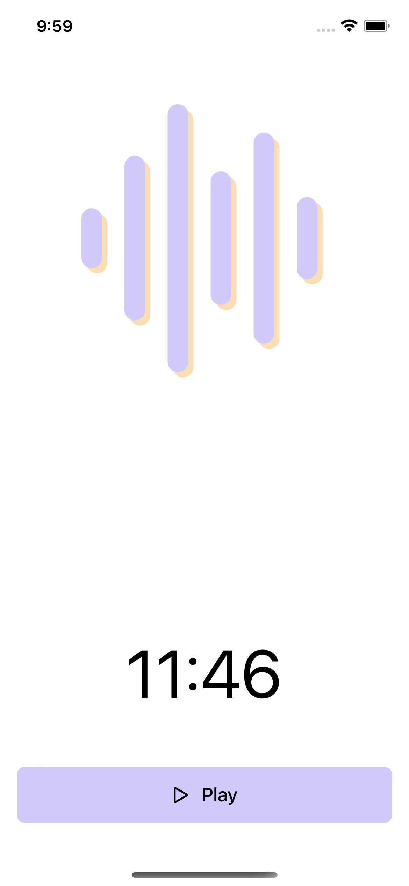
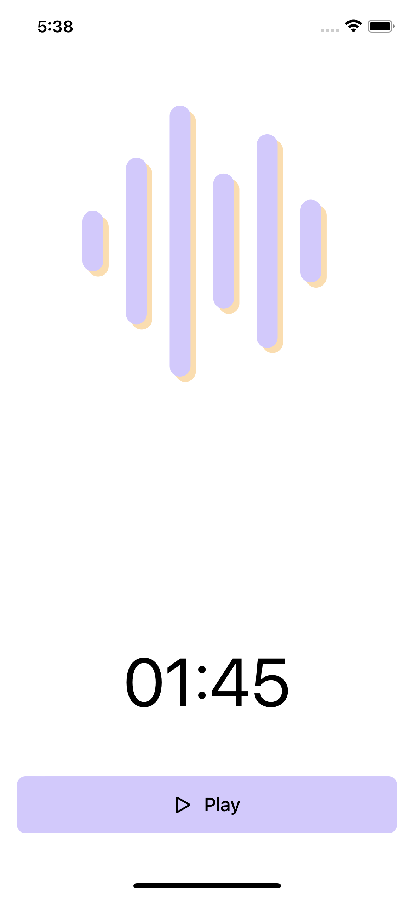

Today I'm going to explain how I was able to implement an audio player for files in .ogg format. I recently worked on a meditation app that used .ogg files to stream the meditations. Let's look at how I approached the implementation, why it was a challenging task, and how one meme lived up to its hype. 

Before I show you how to do it with a SwiftUI example app, let's first understand an OGG format file.


#### What is OGG format?

**Ogg** is a free, open container format maintained by the [Xiph.Org](https://xiph.org) Foundation, a non-profit that develops and maintains several multimedia formats. The most common OGG file format is .ogg (audio file), which is derived from *[Ogg Vorbis](https://en.wikipedia.org/wiki/Vorbis)* as a compressed audio file used for audio. These OGG files include the artist's name, track information, and other metadata. 

The format allows for compression, which results in a small file with high audio quality. And, because it provides high quality in relation to the bandwidth required to stream it, many people prefer OGG over other formats such as MP3 or AAC. 

Perhaps the choice is debatable given the format's obscurity and the lack of hardware support across many streaming devices. 

You can learn more about the file format [here](https://xiph.org/ogg/). 

#### The Problem

You're probably thinking about AVFoundation right now. I did as well! It turns out that .ogg isn't one of the file types supported by AVFoundation. You can look up different supported file types in the [AVFileType](https://developer.apple.com/documentation/avfoundation/avfiletype) documentation. That leaves us with two choices: 

1) Convert the audio file to one of the supported audio formats by forfeiting smaller size and high quality. 
2) Instead of the mighty AVFoundation, use an open-source audio player kit.

We are gonna treat option 2 as our plan A and find an alternative to AVPlayer. 

Enter [VLCKit](https://www.videolan.org)!

#### VLCKit

Now, if you're as old as I am, there's a good chance that you've used the **VLC media player** at least once in your life and can relate to this meme.


VLC is a cross-platform multimedia player and framework that is free and open source. It can play most multimedia files. They also have an open-source library called **VLCKit**, which is a generic multimedia library that can be used for any audio or video playback needs on macOS, iOS, and tvOS.

That could be exactly what we're looking for! Let's find out by creating a small SwiftUI app that attempts to play a *ogg* file using VLCKit. 

#### Getting Started

Download the project materials from Github [here](https://github.com/ajithrnayak/VLCKit-Example) before we begin. You can either follow along with the starter project or jump right into the final project.  

Now, assuming you're following along, build and run the starter project. You'll notice:



This VLCKit-Example is a straightforward SwiftUI iOS app built in MVVM pattern. The user can play and pause an audio file. Feel free to explore the project's source code and files.

Ready to implement media player? Let's go ahead and integrate VLCKit.

#### Installation

Unfortunately, Swift Package Manager support for VLCKit is [still in the works](https://code.videolan.org/videolan/VLCKit/-/issues/302). So, we shall use Cocoapods as dependency manager. 

Let's run following command sequences to integrate the latest VLCKit into our project.

```bash
pod init
open Podfile
```

List **MobileVLCKit** dependency in the `Podfile`:

```ruby
platform :ios, '13.0'
use_frameworks!

target 'VLCKit-Example' do
  # Pods for VLCKit-Example
  pod 'MobileVLCKit'
end
```

Then, run the command:

```bash
pod install
```

You've just added the dependency 'MobileVLCKit'. Before proceeding to the next step, open the '.xcworkspace' file.

**System Dependency**

It is important to note that the following system dependencies are required and must be linked into the project: 

- AudioToolbox.framework

- AVFoundation.framework
- CFNetwork.framework
- CoreFoundation.framework
- CoreGraphics.framework
- CoreMedia.framework
- CoreText.framework
- CoreVideo.framework
- libbz2.tbd
- libc++.tbd
- libiconv.tbd
- libxml2.tbd
- OpenGLES.framework
- QuartzCore.framework
- Security.framework
- VideoToolbox.framework
- Foundation.framework

And, since it's iOS, you also need to link:

- UIKit.framework

> **Note**:
> If you don't remember needing to link frameworks and libraries recently, it's because a [little flag](https://twitter.com/ajithrnayak/status/1548184869435367425?s=20&t=zbXt-yP8PXb1ev0hvEv9gA) takes care of it for you.

That should do it! We're all set to use VLCKit.

#### Using MobileVLCKit

Open the 'PlayerViewModel.swift' file and specify the following import: 

```swift
import MobileVLCKit
```

Make a property declaration in the same file that references `VLCMediaPlayer`: 

```swift
let mediaPlayer = VLCMediaPlayer()
```

Now comes the first of two crucial steps, 

1. Implement `loadTrack(_:)` by creating a VLCMedia object with the file url and assigning it to `mediaPlayer` instance. 

```swift
// MARK: - Load Track

func loadTrack(_ track: Track) {
    let media = VLCMedia(url: track.filePath)
    mediaPlayer.media = media
}
```

2. Replace `togglePlayerState()` with the following implementation for different player control actions.

   ```swift
   // MARK: - Controls
   
   func togglePlayerState() {
       if playerState == .playing {
           playerState = .paused
           pause()
       } else {
           playerState = .playing
           play()
       }
   }
   
   func play() {
       self.mediaPlayer.play()
   }
   
   func stop() {
       self.mediaPlayer.stop()
   }
   
   func pause() {
       self.mediaPlayer.pause()
   }
   
   func setPosition(_ position: Double) {
       self.mediaPlayer.position = Float(position)
   }
   ```

Note that our UI implementation only requires 'play' and 'pause' actions, but a full player would require more controls, which I've implemented for your convenience.
   
Build and launch the app! 
   
Hit the play button; As expected, our audio file should play and pause.

#### Updating Duration

The problem statement for displaying track duration can be split into two subtasks. 

1. Determining the total duration or length of the track and updating the duration label when the screen appears. 
2. Second, while the audio is playing, the remaining duration is constantly updated. Similar to a countdown clock.

**Determine Duration**

To tackle this, we must parse the media item for metadata, which can be done either asynchronously or synchronously.  

Here's a method that makes use of [lengthWaitUntilDate:](https://videolan.videolan.me/VLCKit/interface_v_l_c_media.html#a82e93da5f18bf8584beff1b714d496d4)

```swift
// MARK: - VLCKit Related

private var mediaLength: VLCTime? {
    guard let nowPlusFive = Calendar.current.date(byAdding: .second,
                                                  value: 5,
                                                  to: Date()),
          let length = self.mediaPlayer.media?.lengthWait(until: nowPlusFive) else {
        return nil
    }
    return length
}
```

However, this is a blocking operation that waits up to 5 seconds before returning a result or failure. For this quick experiment, this is good enough.  I'd suggest asynchronously parsing the media item using the following approach for a real-world application.

Modify the implementation of `loadTrack(_:)` to subscribe delegate and initiate parsing with parsing options using [`parseWithOptions`](https://videolan.videolan.me/VLCKit/interface_v_l_c_media.html#aecfb52ec0989cd489fdc2966cd431586):. 

```swift
func loadTrack(_ track: Track) {
    let media = VLCMedia(url: track.filePath)
    media.delegate =  self
    // this is an asynchronus op, check VLCMediaDelegate
    media.parse(withOptions: VLCMediaParsingOptions(VLCMediaParseLocal | VLCMediaFetchLocal))
    mediaPlayer.media = media
}
```

Then, to read metadata, use one of the delegate methods listed below:

```swift
// MARK: - VLCMediaDelegate

extension PlayerViewModel: VLCMediaDelegate {
    func mediaMetaDataDidChange(_ aMedia: VLCMedia) {
        print(aMedia.length)

    }
    func mediaDidFinishParsing(_ aMedia: VLCMedia) {
        print("parsing completed!")
        print(aMedia.length)
    }
}
```

let's get back to our Xcode project.

Replace `durationString` with `@Published` property-wrapper and add convenience helper methods to format `VLCTime` to our needs.

```swift
@Published var durationString: String = ""
// .
// ..
// ....
// ......

// MARK: - Helpers

var duration: Int {
    guard let lengthInMilliseconds = mediaLength?.intValue else {
        return 0
    }
    let msToSeconds = lengthInMilliseconds / 1000
    return Int(msToSeconds)
}

var formattedDuration: String {
    return mediaLength?.stringValue ?? "--:--"
}

func setTrackDuration() {
    self.durationString = formattedDuration
}
```

Before you build and run the app, append `setTrackDuration()` to initializer. 

```swift
init(track: Track) {
    //...
    //......
    setTrackDuration()
}
```
<br/>
Bam! We got there! 



**Countdown Timer**

The possible solutions to this problem are to either maintain a 'Timer' in the project code or to use VLCKit's [time](https://videolan.videolan.me/VLCKit/interface_v_l_c_media_player.html#a5915273012b273885dd9570d56777ccf) and [remainingTime](https://videolan.videolan.me/VLCKit/interface_v_l_c_media_player.html#a994615b429c023db77a00d1efec06fd3). The former approach may give you more control during playback, but you can also keep it simple by making the best use of what's available. 

Let's observe the `remainingTime` property and update the durationString as every second elapses. 

We can observe properties by using Foundation's key-value observing, which has [improved Swift APIs](https://developer.apple.com/documentation/swift/using-key-value-observing-in-swift), or by using Combine's [Publisher](https://developer.apple.com/documentation/combine/publisher). I chose the Publisher approach because I've been experimenting with Combine lately.

Go ahead and edit `PlayerViewModel` using: 

```swift
import Combine

//..
//... 

var cancellable = Set<AnyCancellable>()

//....
//.....

// MARK: - Observers

func setupObservers() {
    observeRemainingTime()
}

func cancelObservers() {
    cancellable.forEach { $0.cancel() }
}

private func observeRemainingTime() {
    mediaPlayer
        .publisher(for: \.remainingTime, options: [.new])
        .sink { remainingTime in
            if let remainingTime {
                self.durationString = remainingTime.stringValue
            }
        }
        .store(in: &cancellable)
}

private func observeTimeElapsed() {
    mediaPlayer
        .publisher(for: \.time, options: [.new])
        .sink { time in
            print("Time: \(time)")
        }
        .store(in: &cancellable)
}
```

Finally, specify `setupObservers()` in the initializer. 

```swift
init(track: Track) {
    //...
    //......
    setupObservers()
}
```
<br/>
Build and run! 


#### Streaming .ogg Audio File

Here's a bonus tip! 

If you want to stream an audio file, VLCKit can do that as well. Easy-peasy! 

Copy and paste the following code block with a sample link to the .ogg file in `AudioTracks.swift`

```swift
static var remoteSampleFileURL: URL {
    return URL(string: "https://upload.wikimedia.org/wikipedia/commons/c/c8/Example.ogg")!
}
```

Next, find the following code in  `ContentView`

```swift
Track(filePath: AudioTracks.sampleFilePath1)
```

and replace it with:

```swift
Track(filePath: AudioTracks.remoteSampleFileURL)
```
<br/>
Run it! and hit the play button. Isn't this impressive? 

#### Conclusion 

As a next step, you can look into `VLCMediaPlayerDelegate` for different ideas and options based on your needs. 

```swift
init(track: Track) {
    //...
    //......
    mediaPlayer.delegate = self
}

extension PlayerViewModel: VLCMediaPlayerDelegate {

    func mediaPlayerStateChanged(_ aNotification: Notification) {
        guard let player = aNotification.object as? VLCMediaPlayer else { return }
        print("Media Player state changed to: \(player.state)")
    }

    func mediaPlayerTimeChanged(_ aNotification: Notification) {
        guard let player = aNotification.object as? VLCMediaPlayer else { return }
        print("mediaPlayerTimeChanged \(player.time.intValue), \(player.position)")
    }
}
```
<br/>

Finally, To summarise what I've learned, 

- What exactly is an.ogg file? 
- How do I integrate VLCKit? 
- Using SwiftUI with MVVM pattern. 
- Using Combine to create an observer pattern. 
- Using VLCKit to stream an audio file without having to download it. 

You can download the project materials from Github [here](https://github.com/ajithrnayak/VLCKit-Example).

I hope you enjoyed it!  

Ciao 👋