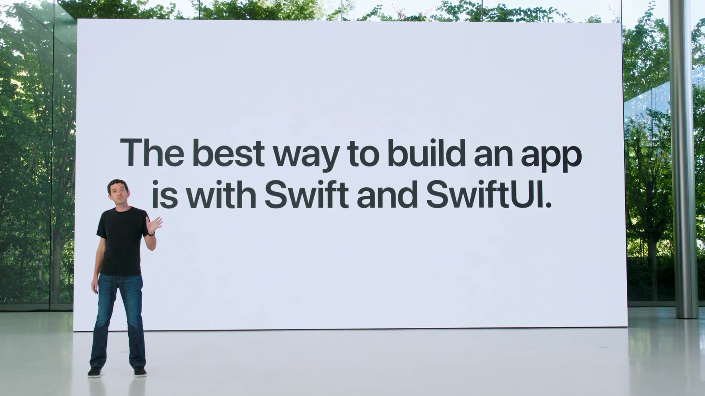
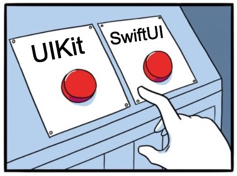

SwiftUI is a significant and refreshing change from the UIKit/AppKit frameworks. Views are values rather than objects, and their creation and modification are declarative in nature, as opposed to the imperative nature of object-oriented frameworks. As a result, the code is easier to read and maintain than code created using alternative frameworks.

In recent years, I've adopted reactive principles and state management while developing iOS apps. Specifically when MVVM and VIP architectural patterns are being used. This was after being bitten by a number of bugs while switching between UI states. I've also worked briefly with the web framework – React, so I'm familiar with the declarative component-style pattern for building user interfaces.



And now, I'm delighted that Apple has finally released [SwiftUI](https://developer.apple.com/documentation/swiftui), a native declarative UI framework for every Apple platform.

In this post, I'll gather and highlight some of the fundamentals of SwiftUI, point out important considerations, and compare and contrast my past and present experiences developing iOS applications.

#### Is SwiftUI Ready?

The most pressing question on the minds of iOS developers right now is whether or not to adopt SwiftUI.



Even though SwiftUI is still relatively new, with major updates released every year, the gap with UIKit is closing when you consider the framework's capabilities and readiness. These [interesting stats](https://blog.timac.org/2022/1005-state-of-swift-and-swiftui-ios16/) of Apple's Swift and SwiftUI-powered apps show a steady rise. Of course, it's far from [matching UIKit](https://twitter.com/ChristianSelig/status/1574207311140327426), and it's still in its early days, but it'll only get better.

So far, my personal preference has been to use a combination of both frameworks depending on the requirements at hand and the development speed at times. And I've finally had the chance to work on a project written entirely in SwiftUI.

So, given the updates from WWDC22 and the ability to easily mix and match SwiftUI and UIKit in both directions, my recommendation is to begin adopting or learning SwiftUI sooner than later.

#### Composing Views & Layout

The `ViewController` has been the most important component of app development in UIKit. It is responsible for instantiating, configuring and updating views and lay out. It had an intricate life cycle that every developer knew.

Views in SwiftUI, on the other hand, are simply lightweight value types that conform to the `View` protocol. Unlike in UIKit, where views were referenced, swiftUI views can be recreated at any time. Furthermore, they can also be grouped together to create simple to more complex user interface components.

The important thing to remember while constructing a view component is the modifiers and their sequence. Each modification made by changing properties creates a new layer. Each layer is of the type `ModifiedContent`. Since each of these modifiers adds a new layer to the view tree, their order often matters.

Consider following example and try swapping the order of modifiers to notice the difference.

```swift
struct PlaceholderView: View {
  private let title = "Hello, Ajith's Blog!"
  private let descr = "Glad to see you."

  var textContent: some View {
    VStack(spacing: 8) {
      Text(title).font(.largeTitle)
      Text(descr)
    }
    .foregroundColor(.white)
  }

  var body: some View {
    textContent
    // try swapping the sequence of the following modifiers
      .frame(width: 300, height: 300)
      .padding(20)
      .background(.black)
  }
}
```

Sequence matters!

The view layout system, on the other hand, is quite different from what we're used to with [Auto-layout](https://developer.apple.com/library/archive/documentation/UserExperience/Conceptual/AutolayoutPG/index.html) or the frame-based approach in UIKit. It is rather simplistic and somewhat reminiscent of [Stack views](https://developer.apple.com/documentation/uikit/uistackview) or CSS [Flexbox](https://css-tricks.com/snippets/css/a-guide-to-flexbox/).

A view renders itself within the available space and, by default, is placed in the centre of that space. However, depending on the size of the implicit content, the actual size of the view may vary.

SwiftUI includes layout modifiers for Frame, Padding, Overlay, Offset, Clipping, and Masking in addition to stack-based layout constructs such as `HStack`, `VStack`, and `ZStack`. There's also `LazyVGrid` and `LazyHGrid` if you prefer grid-based layouts.

But Geometry Readers are probably the most useful when working on a custom layout.

```swift
var body: some View {
  GeometryReader { proxy in
    textContent
      .frame(width: proxy.size.width,
             height: proxy.size.height)
      .background(.black)
  }
}
```

Modify our previous example using the above code sample. As you can see, a `GeometryReader` provides us with the available layout space for a view.

The way we construct views and layouts, both may have felt a little new and syntactically different from how we usually do things in UIKit. But there's no denying that SwiftUI makes it easy to create responsive and adaptive user interfaces.

#### Efficient View Updates

SwiftUI really shines when it comes to how we update views when there is a change.

Because views are value types and are immutable, we can't directly update what's onscreen. Instead, we must explicitly model the state and describe what should appear on screen. And when a state changes, the UI must rebuild. As a result, a whole category of state-related bugs can be eliminated, making UI updates easier to understand.

This concept of state management and reactivity is what makes modern frameworks declarative and it requires a new way of thinking about keeping views in sync with a state model. We have to clearly state our intentions when constructing the user interface.

Think of it like a switchboard for the various lights and fans in your room. The switchboard reflects the state of lighting, and if you want to change the lighting (UI), you must update the state of switches (properies) on the switchboard (state model).


A view update will be triggered each time we change the state property. But how does SwiftUI handle this rebuild in an efficient way? You'd expect it to efficiently render view updates. Particularly for complex interfaces such as lists with large data sets.

The framework doesn't start over by completely redoing the screen after erasing everything. That is inefficient! Instead, SwiftUI has the intelligence to optimize this process so that even complex view hierarchy updates can be performed efficiently.

In order to be efficient, SwiftUI needs to know which of the underlying view elements need to be changed, added, or removed since the last view update. We achieve this with Swift's Property Wrappers.

#### Leveraging Property Wrappers

To manage user interface state, the framework makes the extensive use of a feature made available in Swift 5.1 - [The Property Wrappers](https://www.swiftbysundell.com/articles/property-wrappers-in-swift/).

In the previous example, we used immutable `let` constants as state properties. To provide a view with data that the view doesn’t modify, a standard Swift property is sufficient. However, if a view needs to store data that it can modify, we must use the [`State`](https://developer.apple.com/documentation/swiftui/state) property wrapper to declare the variable. Otherwise, you will appropriately notice the following error.

```bash
Cannot assign to property: 'self' is immutable
```

Consider the following simple example for a timer clock; wrapping the state properties like the one declared with `@State` in our example not only adds mutability but also triggers an update to the corresponding view.

```swift
struct TimerView: View {
  private let timer = Timer.publish(every: 1, on: .main, in: .common).autoconnect()
  @State private var formattedTime: String = "--:--"

  var body: some View {
    Text("\(formattedTime)")
      .font(.largeTitle)
      .onReceive(timer) { time in
        formattedTime = time.formatted(date: .omitted, time: .standard)
      }
  }
}
```

By using it's clever ability to compute a diff, SwiftUI only reevaluates the body of a view that uses a `@State` property when that property has changed.

###### @State vs @Binding

If you haven't already noticed, `@State` is private and is always created in the view (not passed). Interestingly, if we need to store and observe that state outside of the control, we simply change `@State` to `@Binding`, and this property then references a state property stored somewhere else and provides a two-way connection to that storage.

Let's take an example to demonstrate how the control of state is shared with a child view. Here it is:

```swift
import SwiftUI
import PhotosUI

struct PhotosPickerView: View {
  @Binding var selection: [PhotosPickerItem]

  var body: some View {
    VStack(spacing: 20) {
      // The $ prefix asks a wrapped property for its projectedValue
      PhotosPicker(selection: $selection, matching: .images) {
        Text("Select Photos")
      }
      Text("Photos Count: \(selection.count)")
    }
  }
}
```

Unlike a state property, the binding in this case does not have its own storage. Instead, the parent view stores its reference.

```swift
struct ContentView: View {
  @State var selection = [PhotosPickerItem]()

  var body: some View {
    PhotosPickerView(selection: $selection)
  }
}
```

That's pretty much how SwiftUI handles creating and sharing view state.

Fresh breeze!

###### Concept of the Environment

We learned that binding handles direct dependencies passed down from the parent. What about data sharing across a view hierarchy?

When we fetch model data from a parent view, the same data can be passed down to multiple hierarchies of views, eliminating the need to create multiple source of truth for a state. This also helps in the management of data flow via indirect dependencies.

We use the `@Environment` property wrapper for sharing data throughout a view hierarchy, which works similarly to `@State` properties in that when the value changes, a view update is triggered.

A view inherits its environment from its container view using an [`environment(_:_:)`](<https://developer.apple.com/documentation/swiftui/view/environment(_:_:)>) view modifier. Here's a simple example of how to use the environment concept when working with Core Data contexts:

```swift
@main
struct AppMain: App {
  let persistenceController = PersistenceController.shared

  var body: some Scene {
    WindowGroup {
      ContentView()
        .environment(\.managedObjectContext,
                      persistenceController.container.viewContext)
    }
  }
}
```

Many built-in environment values are available in the [EnvironmentValues](https://developer.apple.com/documentation/swiftui/environmentvalues). For example, if you wanted to access the device's colour scheme to see if it was in dark mode, you could simply try:

```swift
@Environment(\.colorScheme) var colorScheme
```

So far, we've dabbled with [State](https://developer.apple.com/documentation/swiftui/state), [Binding](https://developer.apple.com/documentation/swiftui/binding) and [Environment](https://developer.apple.com/documentation/swiftui/environment) to manipuate the state in order to change views. These are for simple properties that belong to a single view. How about complex state properties? In practise, a custom type with multiple properties would be used to manage state, and SwiftUI provides three more property wrappers for just that.

- [StateObject](https://developer.apple.com/documentation/swiftui/stateobject)
- [ObservedObject](https://developer.apple.com/documentation/swiftui/observedobject)
- [EnvironmentObject](https://developer.apple.com/documentation/swiftui/environmentobject)

You will need these property wrappers if you intend to use the [slightly contentious](https://developer.apple.com/forums/thread/699003) MVVM architectural design pattern in your SwiftUI app. Consider the `MeditationListViewModel`, which stores and manages the state properties:

```swift
public final class MeditationListViewModel: ObservableObject {
    @Published var meditations: [Meditation] = []
    @Published private var filteredMeditations: [Meditation] = []
    @Published var searchQuery: String = ""
    @Published var error: Error?

    private var cancellables: Set<AnyCancellable> = []
}
```

The most important thing to note here is that whatever type you use with `@ObservedObject` must conform to the `ObservableObject` protocol. We then use Combine's `@Published` property wrapper to notify views of any changes to state properties.

And depending on who owns the state property, you would use this state object in your view with either `@ObservedObject` or `@StateObject`.

```swift
public struct MeditationList: View {
    @ObservedObject private var viewModel: MeditationListViewModel

    public var body: some View {
    	List($viewModel.filteredMeditations) {
      	//...
      }
    }
}
```

These property wrappers can be confusing when using SwiftUI because they differ subtly. However, they each serve a distinct purpose, and it is important to know the distinction in order to use them correctly in your views. So I'll try to sum up the differences here:

```swift
/// **Source of Truth**
/// - should usually be marked private
/// - always created in your view (not passed)
/// - your view is the owner of the data and is responsible for keeping it alive
///
/// - adds mutability
@State private var elapsedTime = "--:--"
/// - must conform to `ObservableObject` protocol
@StateObject private var meditation = Meditation()


/// **Dependency**
/// - always passed from parent
///
/// - use simple let for immutable state
let title: String
/// - way to read and also write
/// - use to mutate the value passed from parent
@Binding var isCompleted: Bool
/// - not owned directly
/// - a reference type state should use it
/// - must conform to `ObservableObject` protocol
@ObservedObject var meditation: Meditation


/// **Shared Data**
/// - all views point to the same model
/// - created elsewhere in the app
/// - can be private
/// - type is infered
@Environment(\.managedObjectContext) private var viewContext
@EnvironmentObject private var meditation: Meditation
```

These various methods for storing and manipulating state via property wrappers are extremely useful for quickly creating beautiful and functional user interfaces. Here's a comprehensive [list of all the Property wrappers](https://www.hackingwithswift.com/quick-start/swiftui/all-swiftui-property-wrappers-explained-and-compared) available in SwiftUI for you to explore more.

#### Conclusion

Overall, SwiftUI is a promising new framework that makes creating excellent apps simpler than before. In fact, after nearly a decade of developing iOS apps, the declarative syntax, built-in layout system, state management, data binding, and rapid previews are game changers for developers. I no longer have as much envy for web frameworks.
