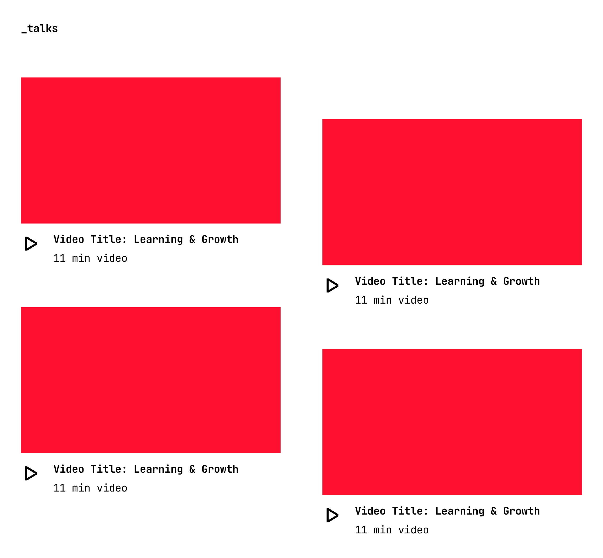
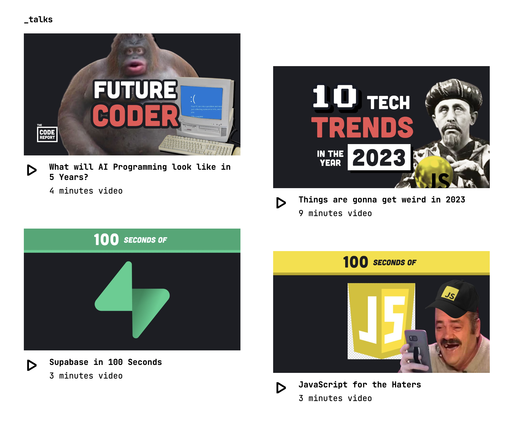

Gridsome is a free and open-source [Jamstack framework](https://gridsome.org/docs/jamstack/) for building fast and modern websites with [Vue.js](https://vuejs.org). It uses the GraphQL query language to access and transform data from a variety of sources, including APIs, databases, and local files. It also includes built-in support for static site generation, which makes it a great choice for creating static blogs, documentation sites, and e-commerce storefronts.

With Gridsome, you have a few different options when it comes to working with data, however in this article, we'll look at a specific challenge of importing recently uploaded videos from a YouTube channel using the [YouTube Data API](https://developers.google.com/youtube/v3).

We will present them in a two-column grid format, as shown in the image below:



#### YouTube API Overview

We'll use Fireship.io, one of my favourite YouTube channels, for our demonstration, so we'll need to use the REST APIs that YouTube provides to import the [recently uploaded videos](https://www.youtube.com/@Fireship/videos).

Here is the API Reference guide for [The YouTube Data API](https://developers.google.com/youtube/v3/docs).

But before we get started, we'll need an [API key](https://developers.google.com/youtube/v3/getting-started#before-you-start) so that we can authenticate and identify the submitted API requests. Follow the instructions to obtain the key.

Note that YouTube uses playlists to identify special collections of videos(such as uploaded videos and positively rated (liked) videos) for a channel. We are interested in a playlist of uploaded videos, so we must obtain the 'playlistId' for this playlist.

###### Get PlaylistId

https://developers.google.com/youtube/v3/docs/channels/list#try-it

We can use the channels resource to retrieve the 'playlist IDs' of special collections for uploaded and liked videos by specifying either the channel's user ID or the channel ID itself.

```http
GET https://youtube.googleapis.com/youtube/v3/channels?part=contentDetails&forUsername=GoogleDevelopers&key=[YOUR_API_KEY]
```

The playlist ID is available as a value for "likes" and "uploads" in the response object under "relatedPlaylists"; copy the "uploads" playlist ID.

```json
"contentDetails": {
  "relatedPlaylists": {
    "likes": "",
    "uploads": "UU_x5XG1OV2P6uZZ5FSM9Ttw"
  }
}
```

**Note:**  
If your response does not contain the expected result, try specifying the channel ID instead of the YouTube username. This [guide](https://support.google.com/youtube/answer/3250431?hl=en) will help you find the channel ID. Alternatively, see this Stackoverflow [thread](https://stackoverflow.com/q/14366648/1835803).

```http
GET https://youtube.googleapis.com/youtube/v3/channels?part=contentDetails&id=UCsBjURrPoezykLs9EqgamOA&key=[YOUR_API_KEY]
```

There you have it, we were able to determine the "playlistId" for uploads to Fireship.io channel using the channel ID.

Next, for the obtained "playlistId," retrieve the playlist items, i,e videos in the "uploads" playlist.

###### Get Playlist Items

https://developers.google.com/youtube/v3/docs/playlistItems/list#try-it

With the help of the playlistitems resource, you can obtain a list of recently uploaded videos by simply providing the "playlistId" and optionally "maxResults" (the default value is 5).

```http
GET https://youtube.googleapis.com/youtube/v3/playlistItems?part=contentDetails%2Cid%2Csnippet%2Cstatus&maxResults=20&playlistId=UUsBjURrPoezykLs9EqgamOA&key=[YOUR_API_KEY]
```

You can learn more by watching [this helpful video](https://youtu.be/RjUlmco7v2M) from Google Developers.

#### Getting a Channel's Uploads

With all of our YouTube Data API knowledge, let's go ahead and implement the API to fetch recent uploads in a javascript module.

The following function is named `fetchRecentTalks` and it is an async function which sends a GET request to the YouTube Data API to get information about videos in a given playlist. If the request is successful, the function will extract the relevant data from the response and return an array of objects, each representing a video in the playlist.

```js
// YouTubeUploads.js

const youtubeKey = "[YOUR_API_KEY]"
const playlistId = "UUsBjURrPoezykLs9EqgamOA"
const maxRecentTalks = "20"

export async function fetchRecentTalks() {
  // Create a new URL object with the base URL for the YouTube Data API
  const videosUrl = new URL(
    "https://youtube.googleapis.com/youtube/v3/playlistItems"
  )
  // Set the necessary query parameters on the URL
  videosUrl.searchParams.set("part", "snippet")
  videosUrl.searchParams.set("maxResults", maxRecentTalks)
  videosUrl.searchParams.set("playlistId", playlistId)
  videosUrl.searchParams.set("key", youtubeKey)

  try {
    // Send a GET request to the API with the constructed URL
    const response = await fetch(videosUrl)
    if (!response.ok) {
      // If the response is not successful (i.e. not in the 2xx range), throw an error
      throw new Error(`HTTP error: ${response.status}`)
    }
    const data = await response.json()
    const { items } = data
    // Map the items array to an array of talks with the desired properties
    return items.map((item) => {
      // Extract the videoId from the snippet
      let videoId = item.snippet.resourceId.videoId
      return {
        id: item.id,
        position: item.snippet.position,
        videoId: videoId,
        title: item.title,
        publishedAt: item.snippet.publishedAt,
        title: item.snippet.title,
        description: item.snippet.description,
        // Concatenate the video ID with the base URL to get the full video URL
        videoUrl: "https://youtu.be/".concat(videoId),
        videoEmbedUrl: "https://www.youtube.com/embed/".concat(videoId),
        thumbnails: item.snippet.thumbnails,
        // TODO: We don't have duration information yet.
        duration: "NA",
      }
    })
  } catch (error) {
    // If there is an error, log it to the console
    console.error(`Could not get talks: ${error}`)
  }
}
```

In our implementation, we used [async-await](https://developer.mozilla.org/en-US/docs/Web/JavaScript/Reference/Statements/async_function). However, you are free to explicitly configure promise chains or even use an HTTP client library like [axios](https://github.com/axios/axios).

#### Get Video Duration

If you recall the design requirement, we need to display duration of the video in minutes however, that information wasn't available in the previous API call to playlistitems resource. Instead we are required to use the videos resource.

https://developers.google.com/youtube/v3/docs/videos/list#try-it

Now, keep in mind that because we are dealing with a collection of videos (up to 20 videos based on `maxRecentTalks`), retrieving details about a specific video by looping through playlist items is not the best option. There is a better way; the 'id' parameter accepts a list of YouTube video IDs separated by commas. This means that the same API can retrieve data for a collection of videos as well.

In your API request, you can therefore include one or more video IDs.

```http
GET https://youtube.googleapis.com/youtube/v3/videos?part=snippet%2CcontentDetails%2Cstatistics&id=eaedq1Jl2fc%2C1v_TEnpqHXE%2CzBZgdTb-dns%2CaXOChLn5ZdQ%2ClkIFF4maKMU&key=[YOUR_API_KEY]
```

###### Determine Quota Cost

Another important consideration when submitting requests to the YouTube Data API is the quota cost for calling each API method. Every API request has a quota cost of at least one point, even if the request is invalid.


Checkout this [Quota Calculator](https://developers.google.com/youtube/v3/determine_quota_cost) for more information.

###### Video Details API

Let's go ahead and implement the API to retrieve information about videos based on their IDs. Because we are only interested in duration of the video, specifying 'contentDetails' as the value for 'part' is sufficient.

```js
// YouTubeUploads.js
//..
//...
//....

async function getVideoDetails(videoIds) {
  // create a URL object with the YouTube API endpoint
  const videoUrl = new URL("https://youtube.googleapis.com/youtube/v3/videos")

  // set query parameters to request the content details of the specified video
  videoUrl.searchParams.set("part", "contentDetails")
  videoUrl.searchParams.set("id", videoIds)
  videoUrl.searchParams.set("key", youtubeKey)

  try {
    const response = await fetch(videoUrl)
    if (!response.ok) {
      throw new Error(`HTTP error: ${response.status}`)
    }
    const data = await response.json()
    // extract the content details and map it to respective videoID
    const { items } = data
    return Object.fromEntries(items.map((i) => [i.id, i.contentDetails]))
  } catch (error) {
    // log an error message if the request fails
    console.error(`Could not get video details: ${error}`)
  }
}
```

Copy over the `getVideoDetails` function, which sends a GET request to the YouTube API in order to retrieve the content details for the specified video IDs. To make it easier to look up video details using a video ID, let's associate each video ID with the video's content details, which typically include information such as the video duration, dimensions, definition, and so on.

Now, modify the `fetchRecentTalks` function and address the duration TODO.

```js
export async function fetchRecentTalks() {
  // ..
  // ...
  // ......

  // **** insert this ***
  // fetch video details(such as duration) using videoId
  const videoIds = items.map((item) => item.snippet.resourceId.videoId)
  const videoDetails = await getVideoDetails(videoIds)

  // Map the items array to an array of talks with the desired properties
  return items.map((item) => {
    // Extract the videoId from the snippet
    let videoId = item.snippet.resourceId.videoId
    return {
      // ..
      // ...
      // ....
      // *** update this ***
      duration: videoDetails[videoId].duration,
    }
  })
  // ..
  // ....
}
```

Wonderful!

But wait, the format of the duration string isn't what we want. Instead, the format is [ISO 8601](https://en.wikipedia.org/wiki/ISO_8601#Durations). So we need to figure out how to parse ISO 8601 duration strings in JavaScript.

#### Parse ISO 8601 Duration Strings

There are a few options for parsing ISO 8601 duration strings in JS, but none of them are native solutions [yet](https://tc39.es/proposal-temporal/docs/duration.html). There are numerous open source software programmes and libraries available, including the popular library – [moment.js](https://momentjs.com).

Make the following change to make it complete:

```js
const moment = require("moment")
//..
//....
// Replace following line in `fetchRecentTalks`
duration: moment.duration(videoDetails[videoId].duration).humanize()
```

As an alternative, take a look at my suggestion on this Stackoverflow [thread](https://stackoverflow.com/a/74743033/1835803).

#### Displaying the YouTube API Data

There are primarily two ways to import external data into our Gridsome site after retrieving it from a REST API datasource.

We can use the [Data Store API](https://gridsome.org/docs/data-store-api/) to add external data to the store and make it available on the GraphQL data layer. You will then be able to query that data in your Vue components' `page-query` and `static-query` tags.

However, this isn't ideal for our current requirement because we want to keep it out of the generated markup and refresh data after each page load.

This can be done by loading our data using the `mounted` hook.

```js
import { fetchRecentTalks } from "../utils/YouTubeUploads"

export default {
  data() {
    return {
      talks: null,
    }
  },
  async mounted() {
    try {
      const results = await fetchRecentTalks()
      this.talks = results
    } catch (error) {
      console.log(error)
    }
  },
}
```

Checkout Gridsome documentation on [Client-side data](https://gridsome.org/docs/client-side-data/) for more.

#### Creating a Vue.js Component

Finally, it's time to put on our magician's hat and start working on the front-end component.

🎩🪄✨

We'll begin with a component called `Talks.vue`, which implements the two-column grid. The component is shown here in all its splendour.

```vue
<template>
  <div class="talks">
    <h3>_talks</h3>
    <div class="talks-group">
      <div class="col-left">
        <div
          class="item"
          v-for="(talk, i) in col1Tiles"
          :key="i"
          @click="showTalk(talk.videoEmbedUrl)"
        >
          <TalkTile :talk="talk" />
        </div>
      </div>
      <div class="col right">
        <div
          class="item"
          v-for="(talk, i) in col2Tiles"
          :key="i"
          @click="showTalk(talk.videoEmbedUrl)"
        >
          <TalkTile :talk="talk" />
        </div>
      </div>
    </div>
    <Modal :show="modalVisible" :close-handler="hideTalk">
      <iframe
        width="100%"
        height="100%"
        :src="talkUrl"
        frameborder="0"
        allow="accelerometer; autoplay; clipboard-write; encrypted-media; gyroscope; picture-in-picture"
        allowfullscreen
      >
      </iframe>
    </Modal>
  </div>
</template>

<style lang="scss" scoped="true">
@import "../assets/vars.scss";
.talks {
  margin-bottom: 100px;
}
.talks-group {
  display: grid;
  grid-template-columns: 1fr 1fr;
  column-gap: 80px;
  .right {
    margin-top: 80px;
  }
  .item {
    margin-bottom: 80px;
  }
}
@media #{$medium-only} {
  .talks-group {
    column-gap: 16px;
    .item {
      margin-bottom: 16px;
    }
  }
}
@media #{$small-and-down} {
  .talks-group {
    grid-template-columns: 1fr;
    column-gap: 0;
    .right {
      margin-top: 0;
    }
    .item {
      margin-bottom: 16px;
    }
  }
}
</style>

<script>
import Modal from "./Modal"
import TalkTile from "./TalkTile.vue"
import { fetchRecentTalks } from "../utils/YouTubeUploads"
export default {
  components: { Modal, TalkTile },
  data() {
    return {
      allTalks: [],
      modalVisible: false,
      talkUrl: "",
    }
  },
  async mounted() {
    try {
      const results = await fetchRecentTalks()
      this.allTalks = results
    } catch (error) {
      console.log(error)
    }
  },
  computed: {
    col1Tiles() {
      return this.allTalks.filter((e, i) => (i % 2) - 1)
    },
    col2Tiles() {
      return this.allTalks.filter((e, i) => i % 2)
    },
  },
  methods: {
    showTalk(url) {
      this.talkUrl = url
      this.modalVisible = true
    },
    hideTalk() {
      this.modalVisible = false
    },
  },
}
</script>
```

This component fetches a list of recent talks from our YouTubeUploads module, and displays them in a grid. The user can click on a talk to open a modal that displays the talk's video and perhaps, modal's implementation is beyond the scope of this post.

As you can see, for maintainability, readability, and other reasons, I separated the implementation of each tile into a separate component called `TalkTile.vue`. This is what it does:

```vue
<template>
  <div class="talk">
    
    <div class="talk-details">
      <span class="icon">|></span>
      <span class="title">
        <div>{{ talk.title }}</div>
        <div class="duration">{{ talk.duration }} video</div>
      </span>
    </div>
  </div>
</template>

<style lang="scss" scoped="true">
.talk {
  box-sizing: border-box;
  display: flex;
  flex-direction: column;
  justify-content: flex-start;
  gap: 16px;
  position: relative;
  overflow: hidden;

  img {
    max-width: 100%;
    max-height: 100%;
  }
}
.talk-details {
  display: flex;
  align-items: flex-start;
  gap: 24px;
  cursor: pointer;
  font-family: "heading";
  .icon {
    font-size: 2rem;
  }
  .title {
    display: flex;
    flex-direction: column;
    align-items: flex-start;
    padding: 0px;
    gap: 8px;
    font-size: 1.25rem;
  }
  .duration {
    font-family: "body-jetbrains";
  }
}
</style>

<script>
export default {
  props: ["talk"],
  computed: {
    thumbnailUrl() {
      return this.talk.thumbnails.maxres
        ? this.talk.thumbnails.maxres.url
        : this.talk.thumbnails.high.url
    },
  },
}
</script>
```

The component expects to receive a "talk" object as a prop, which it uses to populate the template with the relevant information. It also has a computed property called `thumbnailUrl` that determines the URL of the thumbnail image to display based on the availability of different thumbnail sizes.

Let's take a look at the final result now.

Hit refresh!



That's perfect!

Until the next one, take care.
