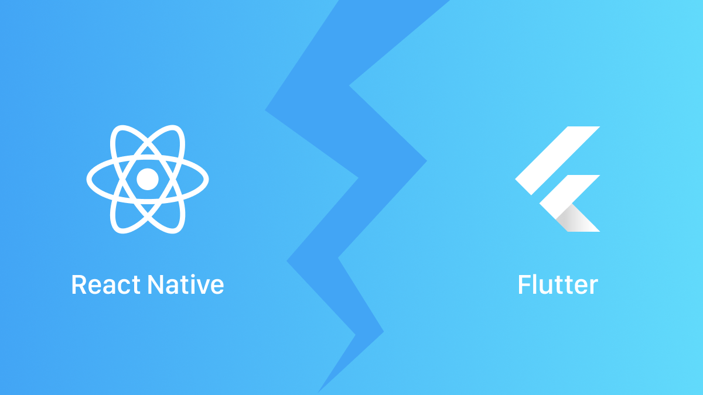

While mobile phones are playing an indispensable role in the daily lives of most people, the mobile app development has also evolved drastically.

Native development is still preferred for building [remarkable experiences](https://twitter.com/family/status/1611408756516204544). However, maintaining multiple codebases and dedicated teams for traditional native app development can be challenging.

That’s why multi-platform frameworks like Facebook’s [React Native](https://reactnative.dev/) and Google’s [Flutter](https://flutter.dev/) are becoming popular choices for building mobile apps from a single codebase.

In this article, we’ll assess these frameworks for a consulting project, looking at technical and business implications and making a choice that fulfils your requirements in 2023 and beyond.

If you are a technical leader currently evaluating which framework is the best fit for your project, this is a relevant discussion. Feel free to browse specific sections based on your level of knowledge and familiarity.

- [Elephant in the room](#elephant-in-the-room)
- [The React Native Bridge](#the-react-native-bridge)
- [Why Pick React Native?](#why-pick-react-native)
- [Trade-offs with React Native](#trade-offs-with-react-native)
- [Flutter’s Rising Popularity](#flutters-rising-popularity)
- [Why developers adore Flutter?](#why-developers-adore-flutter)
- [Challenges of using Flutter](#challenges-of-using-flutter)
- [Expo to the Rescue](#expo-to-the-rescue)
- [Which is right for you?](#which-is-right-for-you)
- [Final Thoughts](#final-thoughts)

Practical experience are invaluable in the ChatGPT era. Hence, we’ll create a simple Bookmark app in both frameworks to illustrate our observations, even though the world probably doesn’t need another Bookmark app.

## Elephant in the room

The elephant in the room when considering mobile app development is the challenge of maintaining multiple codebases, hiring narrowly specialized engineers, synchronising timelines, iterations, and time to market, and, of course, project budget.

Our consulting client needed a solution to these challenges in order to achieve efficiency in terms of both time and cost, and to address this, we decided to go with a cross-platform, unified codebase.

However, it’s important to note that the reasons for choosing a cross-platform approach can vary, such as not needing a full range of platform-specific features for your app business, maintaining consistent UI/UX for all platforms, utilising available talent, and so on.

Therefore, the answer to most questions in consulting is simply “it depends,” this is also true for Flutter vs React Native or even the longstanding Native vs Cross-platform debates. There are always trade-offs.

The decision to choose an approach is influenced by a number of factors, including the project’s specific requirements, the skill level of the development team, the current job market in your area, performance, ease of development, community support, and more.

Fair enough!

Let’s make a head-to-head comparison of few important areas where one framework might be a better choice than the other. That might provide us with a clear choice.

## The React Native Bridge

[ReactJS](https://react.dev/) is a widely used JavaScript library for building user interfaces introduced by Meta/Facebook. In 2015, the company open-sourced React Native, a framework based on React specifically for building mobile apps for Android and iOS.

###### How it Works

In iOS development, apps are written in Swift or Objective-C, while in Android development, they are written in Kotlin or Java. If only there was a single programming language and set of tools that could generate native UI for both platforms — that would be a straightforward solution, wouldn’t it? That is precisely what happens with React Native.

Using JavaScript, we describe the layout, view elements and interactions with React components. Then, using a communication bridge and a JavaScript engine, React Native translates those core components into native components (separately for each platform). After that, the communication bridge awaits a callback response from the native module for events and underlying platform APIs written in native code, such as the camera or accelerometer.

In layman’s terms, the end result is a truly native app for the corresponding platform, but built with React and JavaScript. The JavaScript code that you wrote runs on JavaScript engine ([JavaScriptCore](https://developer.apple.com/documentation/javascriptcore)) and the React Native Bridge is responsible for communication between native modules and JavaScript side.

Here’s an illustrative explanation:

That was a brief explaination of React Native’s architecture but important to our discussion here.

The use of JavaScript as a programming language, React-based UI components, the translation layer bridge, describing the layout and interface, and development experience that is similar to web development all have significant implications in terms of technical aspects, developer preferences, and hiring considerations.

So, let’s take a closer look at all of these factors and how they impact the decision to use React Native.

So, let’s take a closer look at all of these factors and how they impact the decision to use React Native.

## Why Pick React Native?

JavaScript is the language of the web and by far the [most popular](https://survey.stackoverflow.co/2022/#section-most-popular-technologies-programming-scripting-and-markup-languages)programming language. So the fact that React Native uses it is a major plus. Most developers are probably already familiar with it. Then there’s ReactJS, which is still the [most in-demand](https://2022.stateofjs.com/en-US/libraries/front-end-frameworks/#front_end_frameworks_experience_ranking) framework for creating web apps. Together, they make up a large developer community & mature ecosystem.

A quick LinkedIn talent search for Javascript easily tops the results count. The same is true for React!

The tooling is similar to that of the web; using the [React Native CLI](https://reactnative.dev/docs/environment-setup#react-native-command-line-interface), we should be able to set up the basic environment needed for the app. Then there are third-party libraries like axios, mobx, redux, lodash, ramda, eslint, babel, jest, prettier, react-devtools, and npm that are shared by web as well.

This means, there are more developers on the market who are familiar with all of these. It should be even more easier for web developers to pick up React Native. And, native mobile developers may find the skill desirable because they can port those skills to the web.

All of this has a direct impact on hiring; it becomes easier to find developers with the right skills. And, I should add, it’s no less of a factor to consider in this debate. In fact, hiring and maintaining the project beyond the duration of our contract was one of the first criteria given by our client.

The Layout and UI abstractions are based on CSS and [Flexbox](https://developer.mozilla.org/en-US/docs/Web/CSS/CSS_Flexible_Box_Layout/). React Native also includes a set of essential, ready-to-use [Core Components](https://reactnative.dev/docs/intro-react-native-components), which eliminates the need to rebuild all of the essential components. Because it renders native UI on each platform, your app is also consistent with each platform’s existing UI as well as accessibility.

And, if there is a React Web App, it makes a good argument for choosing React Native because engineering can share code, knowledge, and documentation through common wikis. Plus, you may also share developers who are fluent in JavaScript or React.

What if I told you that React Native can be integrated into an existing native project? Yes, depending on the circumstances of your project, you [can add](https://reactnative.dev/docs/integration-with-existing-apps)new features, modules, or even a single screen based on React Native. That could be such a convenience for projects that aren’t brand-new or that can’t yet prioritise a total rewrite.

Finally, the cherry on top, out of the box support for [CodePush](https://github.com/microsoft/react-native-code-push) — a feature that allows app updates to be pushed without having to go through the App Store or Google Play Store update process. This is a major advantage, as it allows developers to quickly fix bugs, add new features, and improve performance without forcing users to download and install updates.

###### What's New?

Earlier this year, React Native version 0.71 was [announced](https://reactnative.dev/blog/2023/01/12/version-071). While [TypeScript](https://www.typescriptlang.org/)was already supported, creating a new React Native app with the React Native CLI now gets a TypeScript app by default. As a result of this first-class support, even the documentation now shows TypeScript as the new default language. Commendable move!

In the legacy render system, a dedicated thread called [React Shadow Tree](https://reactnative.dev/architecture/glossary#react-shadow-tree-and-react-shadow-node)was in charge of calculating the layouts defined in JavaScript and sending that information to the main thread of the respective platforms via the bridge.

[Fabric](https://reactnative.dev/architecture/fabric-renderer), React Native’s new C++ rendering system, improves interoperability with host platforms while avoiding platform-specific render logic.

Also, remember the JavaScript Engine? JavaScriptCore?

There was a support for another high performance JavaScript engine optimized for React Native — [Hermes](https://youtu.be/JsppO1HUYx4).

In React Native [0.70](https://reactnative.dev/blog/2022/09/05/version-070#hermes-as-default-engine), it is now the default engine for React Native. And it matters!

JavaScriptCore runs the Safari browser, but it must be shipped with Android apps, resulting in poor performance on low-end Android phones. Hermes is optimised for mobile apps, resulting in significant improvements in build times, JSON parsing, IDE support, and dependency management.

With the help of [JSI](https://reactnative.dev/architecture/glossary#javascript-interfaces-jsi) and [Turbo Modules](https://reactnative.dev/docs/next/the-new-architecture/pillars-turbomodules), React Native’s overall cross-platform architecture is expected to improve even further.

Sounds excellent? Choosing React Native seems like a no-brainer?

Wait a second, though!

As with any engineering decision, there are always trade-offs to consider, and React Native is no exception. Let’s dig a little deeper into those…

## Trade-offs with React Native

With TypeScript, there’s type safety to catch errors early. However, it needs to be transpiled to JavaScript before being run in Hermes. JavaScript isn’t exactly blazing-fast either, but I wouldn’t moan just yet.

React Native’s tooling, on the other hand, is far more complex. Similar to web development, setting up a project with React Native is all about writing your own adventure tale.

With our tiny LinkHub project, we first focused on iOS. Because the setup differs depending on the development OS and target platform. For iOS alone, Node, Watchman, React Native CLI, Ruby version manager, Bundler, and iOS-specific tools such as Xcode and CocoaPods were required. Despite this, we faced a few hurdles ([1](https://stackoverflow.com/questions/74296204/installing-bundler-error-error-looks-like-your-ios-environment-is-not-properl), [2](https://github.com/facebook/react-native/issues/35726), [3](https://stackoverflow.com/questions/73833458/swiftemitmodule-normal-arm64-emitting-module-for-yogakit-in-target-yogakit) & [4](https://stackoverflow.com/questions/70574985/could-not-find-minitest-5-1-among-39-total-gems-gemmissingspecerror)) before we were able to run the default app on iOS Simulator.

Web developers may find it easier with tooling, but they may need to learn about mobile platform tools. Personally, my career learning path included both iOS and web development. So, prior knowledge was greatly useful, but if you are new, this could easily frustrate anyone.

You begin with basic tools, but soon become overly reliant on third-party community tools & packages. Using third-party solutions comes with its own set of challenges, such as inactive/deprecated support, growing app bundle size, painful upgrade experiences, and so on. So be cautious when integrating third-party packages.

Another downside is the translation layer bridge, which can restrict access to native functionality and may cause performance issues in more complex apps. Though it is possible to [write platform-specific](https://reactnative.dev/docs/platform-specific-code) code as needed, there may be a learning curve involved or you’d need a specialist with domain-specific expertise.

Overall, as long as the time saved by the unified codebase is not consumed by the friction of the developer experience and tooling leading to unpredictable maintenance, we should be fine.

## Flutter's Rising Popularity

In 2018, Google released the first version of Flutter as open source framework. Since then, it has grown in popularity, and popularity matters. Flutter, which consists of both framework and SDK, has several “wow” factors, one of which is how it works. Perhaps that is why app makers adore it so much!

###### How it Works

First off, Flutter is more than just a framework with a collection of pre-built components (widgets) and UI elements; it also includes a set of tools, compiling and rendering engines, debuggers, and packages for common tasks.

Unlike React Native, the end result is not a native app on the target device; rather, Flutter takes over the entire screen and renders its own UI. Similar to video game built with a gaming engine like Unity. This rendering engine, known as [Skia](https://skia.org/), is built using C++ and draws every pixel of UI from scratch on each platform. This enables us to build software for mobile, desktop, and, interestingly, [medical imaging softwares](https://twitter.com/ryanramchandar/status/1631434969091395586).

It uses a programming language called [Dart](https://dart.dev/) (again, created and maintained by Google) that is optimised for cross-platform compilation. Even though it isn’t that well-known or old, it is a type-safe and null-safe language that shares strong similarities with TypeScript.

Certainly, there’s a lot of magic going on under the hood on specific platforms. For example, on iOS, a `FlutterViewController` is loaded to handle events and then attached to a `FlutterEngine`, which paints frames using the [Metal](https://developer.apple.com/documentation/metal/) framework.

In comparison to other cross-platform solutions, Flutter claims to perform better as a result. Though most end-users are unlikely to notice the performance differences, there are benchmark [examples](https://medium.com/swlh/flutter-vs-native-vs-react-native-examining-performance-31338f081980) to support the claim.

## Why developers adore Flutter?

The tooling offered is simply phenomenal in comparison to what we experienced in React Native, which brings us to the next impressive factor.

From the beginning, [flutter doctor](https://docs.flutter.dev/get-started/install/macos#run-flutter-doctor), starter kit, integration with popular IDEs, code highlighting, auto-completion, and built-in debugging tools are all a fresh breeze.

There are a whole bunch of tricks that can enable developers to be highly productive. The Refactor tool, in particular, makes it extremely convenient for both seasoned developers and newcomers who are unfamiliar with syntax.

Flutter uses widgets to create user interfaces, which is a declarative approach inspired by the React framework that uses state management to efficiently render UI.

Developers can iterate quickly using the Hot Reload feature, which is similar to React Native’s [Fast Refresh](https://reactnative.dev/docs/fast-refresh). Given how inconvenient mobile SDKs are in this regard, this feature would be greatly appreciated by mobile engineers.

Along with a suite of basic widgets, Flutter provides a set of pre-built widgets and tools for building slick and responsive UIs, making it simple for developers. When developing for mobile, the two widget libraries Material (Android) and Cupertino (iOS) make it easier to match the UI of each individual platform.

You can almost certainly ship an app without any third-party packages because there are numerous core first-party packages for localization, HTTP requests, multi-threading, and more. And if you’re feeling curious, the community has created alternatives to Flutter’s state management solutions (`StatefulWidget` and `StatelessWidget`).

Because Flutter is new, it came with modern capabilities, convenient tooling, and a new programming language with modern niceties, resulting in a delightful developer experience.

If you’re curious about Flutter’s future developments, check out the [what’s next post](https://medium.com/flutter/whats-next-for-flutter-b94ce089f49c).

## Challenges of using Flutter

Faster performance is one of Flutter’s key selling points. Although, it may not always [outperform](https://twitter.com/gordonphayes/status/1617535312313610247) native apps. Moreover, even with the fastest framework, it is possible to build a poorly-performing app if best practises are not followed.

The tooling is exceptional, but because it is a relatively new ecosystem, third-party libraries and community support is not as extensive as React Native. So, if we need some libraries to support fringe areas, we’d be out of luck.

Apps built with Flutter may not always feel completely native because they must share all of their UX and UI layers. The final app bundle size is also bigger in comparison because it has its own widgets, libraries, and runtime ([perhaps not for long](https://github.com/flutter/flutter/issues/16833)).

You can add Flutter to an [existing app](https://docs.flutter.dev/development/add-to-app) or write platform-specific code using [Platform Channels](https://docs.flutter.dev/development/platform-integration/platform-channels), just like in React Native. However, there will be a learning curve and bumps in the road.

Code Push, the icing on the cake, is currently not supported by Flutter and is not on the [roadmap](https://github.com/flutter/flutter/issues/14330).

When it comes to state management, Redux and React Hooks are more likely to feel natural with React Native. However, there are a [few approaches](https://docs.flutter.dev/development/data-and-backend/state-mgmt/options) to state management in Flutter, including the Redux framework, which many web developers are familiar with but can be intimidating.

One discouraging challenge could be learning a new programming language specifically for Flutter. But Dart is also new. As a result, it provides modern language features and syntax, making it easier to learn. And the we’ve to applaud the [documentation efforts](https://docs.flutter.dev/get-started/flutter-for/swiftui-devs) by Flutter Team. So, learning the entire tooling, language, styling, and ecosystem is less likely to be a deal-breaker, but it still requires extra effort.

Okay, then!

Developers are gushing with praise? Should it then be our top choice?

Can developer experience be the deciding factor on its own?

Hold on to that thought for the time being.

Remember how React Native’s project setup and tooling baffled us? And Flutter is slick as silk? Well, similar to Flutter, another framework called Expo will help you build React Native apps with ease by providing a bundle of tools and services. Let’s find out more…

## Expo to the Rescue

[Expo](https://expo.dev/) is a set of developer tools and services built around React Native that, in many ways, resembles the developer experience of Flutter. It is rapidly evolving and already offers so much more. It’s as if someone borrowed a page from Vercel’s [Next.js](https://nextjs.org/) and applied it to React Native.

To name a few advantages:

- An app called “Expo Go” that allows us to test our apps on mobile devices using just a QR code scan.
- Provides deeply integrated cloud services for React Natives apps under Expo Application Services.
- You can build apps without using Xcode or Android Studio. Fantastic, right?
- With the ability to write [JavaScript interface (JSI) native modules](https://docs.expo.dev/modules/module-api/) with Swift & Kotlin, you don’t need to write native iOS or native Android code.
- Create and share example apps in the browser with [Snack](https://docs.expo.dev/workflow/snack/).

The caveat is that it is a private company, and while the framework is open-source, the services provided are on a [pricing](https://expo.dev/pricing) basis and restrictive due to deep integrations.

Here’s how we used Snack to implement our LinkHub — React Native Project:

 

The way that Expo combines the best of the web and mobile is amazing, isn’t it?

So, if we choose Flutter over React Native for its tooling, Expo will persuade us otherwise.

## Which is right for you?

In conclusion, after analyzing and comparing React Native and Flutter, it’s apparent that there isn’t a clear winner. This is a common observation among various blog posts that compare the two frameworks.

Making a definitive choice based on one or two specific tools that you find useful is likely to change as other frameworks catch up. Especially, both React Native and Flutter have strong backing from tech giants and will continue to receive updates and support, ensuring their longevity.

While Flutter offers better performance, superior tooling and developer confidence, React Native outshines in maturity, larger community, native look & hiring needs. With Expo’s help, it is catching up to Flutter in other aspects.

Ultimately, the decision on which framework to use should be based on your team’s needs and capabilities. The best framework is the one that best suits your team’s skillset and goals.

Do you have a engineering team that is well-versed in JavaScript or React? Pick React Native.

Your engineers are a passionate bunch who are willing to bet on Flutter’s growing demand and popularity? Pick Flutter.

And, if you have the budget for it, if your app requires writing a lot of native code or building packages from scratch, or if you care about performance? Pick native itself.

## Final Thoughts

The app economy is in an exciting stage, as are the development tools and frameworks that surround it. Some cross-platform advantages, such as reactive programming model and hot reloading, have [made their way](https://ajith.blog/elements-of-swiftui/) into native development with the introduction of SwiftUI and Jetpack Compose.

Even so, making this choice can be tricky. I specialize in providing comprehensive mobile design and development services tailored to your specific needs. So, I’m happy to offer guidance on selecting the most suitable option. [Drop me a message](mailto:hey@ajith.xyz); I’d be glad to help.

Source Code LinkHub project can be found at:

1. [LinkHub React Native Version 0.71](https://github.com/ajithrnayak/LinkHub_RN)
2. [LinkHub React Native Version 0.69](https://github.com/ajithrnayak/linkhub_rn_jsc)
3. [LinkHub Flutter](https://github.com/ajithrnayak/linkhub_flutter)

I hope you enjoyed reading; Until next one ✌️
