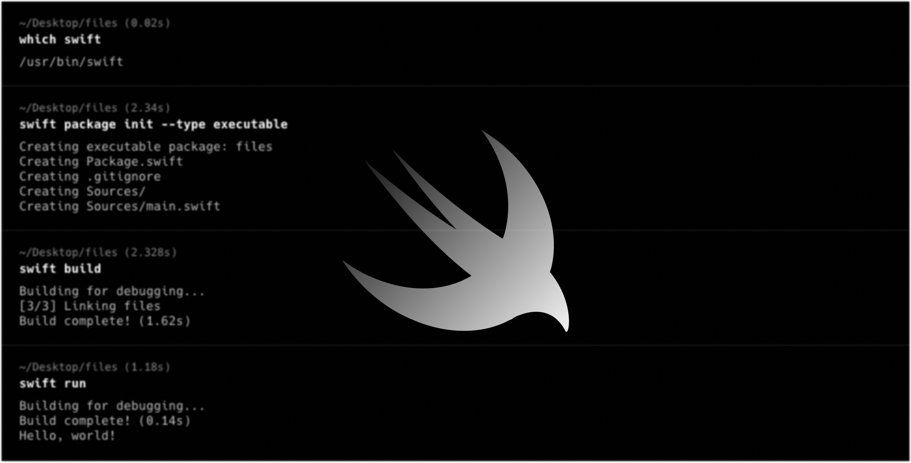
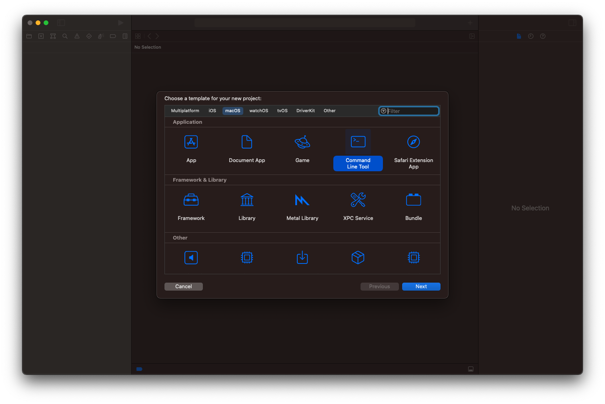
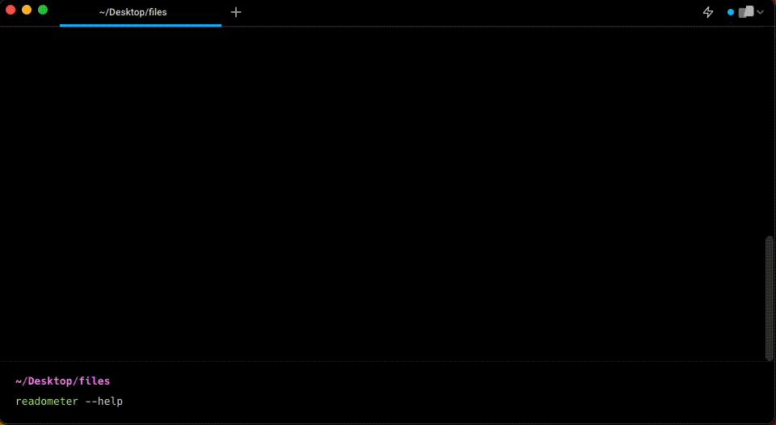

## Introduction

As a writer, I've been using a minimalist editor called [Typora](https://typora.io) to write my articles, and I absolutely love it. However, I realized that I wanted to be able to analyze the time it takes for readers to go through my articles. This led me to the idea of building a simple command-line tool to estimate the reading time of an input file.

Command-line tools are an efficient way for developers to complete a variety of tasks. Using Swift Package Manager (SPM) and [swift-argument-parser](https://github.com/apple/swift-argument-parser), it's even easier to create command-line tools in Swift. In this post, we'll walk through the process of building a tool to estimate reading time using these tools. By the end, you'll have a basic understanding of how to create command-line tools in Swift and be able to apply this knowledge to your own ideas.

## Setting up the project

Let’s build a simple tool called `Readometer` (Read-o-meter) that reads an input file, counts the words, estimates reading time and displays the outcome. We'll be using Xcode and Swift Package Manager (SPM) to create our tool.

To get started, we need to set up our project and there are two ways to go about it.

#### Option 1: Using Commands

First, using following commands you can create a Swift Package.

```bash
$ mkdir Readometer
$ cd Readometer
$ swift package init --type executable
```

The command automatically takes the folder name as the name of the executable and generates a basic setup. You can then try following commands to see it in action.

```bash
$ swift build
$ swift run
```

To continue further with customizing this basic template to fit our needs, let's launch the project in Xcode.

```bash
$ xed Package.swift
```

Xcode can now directly open "Package.swift" to edit sources, run tests, and so on. Give it try!

Finally, we need to add [swift-argument-parser](https://github.com/apple/swift-argument-parser) — Apple's open-sourced framework for straightforward, type-safe argument parsing for Swift — as a dependency to our package, and then include `"ArgumentParser"` as a dependency for our executable target. Our "Package.swift" file ends up looking like this:

```swift
// swift-tools-version: 5.8
// The swift-tools-version declares the minimum version of Swift required to build this package.

import PackageDescription

let package = Package(
    name: "Readometer",
    products: [
        .executable(
            name: "readometer",
            targets: ["Readometer"]
        ),
    ],
    dependencies: [
        .package(url: "https://github.com/apple/swift-argument-parser.git", .upToNextMajor(from: "1.0.0")),
    ],
    targets: [
        .executableTarget(
            name: "Readometer",
            dependencies: [
                .product(name: "ArgumentParser", package: "swift-argument-parser"),
            ],
            path: "Sources"
        ),
    ]
)
```

#### Option 2: Using Xcode

Or, alternatively, you can just use the Xcode's new project template and chose "Command Line Tool" application under macOS (as shown in the picture below).



Then, in a typical way, under Package Dependencies section of the project, search for "swift-argument-parser" and select it.

With these steps, you now have a new Swift command-line tool project set up in Xcode with ArgumentParser added as a dependency. You're ready to move on to the next step of defining your command-line arguments.

## Defining command-line arguments

Now that we have our project set up, let's jot down our expectations. Once we’ve built the `readometer` tool, we should be able to run it like this:

```bash
$ readometer estimate <a file path> --verbose
Estimated reading time: 10 minutes
```

The command in the code above is "readometer," the subcommand is "estimate," a file path would be an argument, and a flag is appended.

Let's begin by creating the command that directly accepts the file path argument using ArgumentParser. Subcommand and flag options can wait till later.

```swift
// Readometer.swift
import ArgumentParser

@main
struct Readometer: ParsableCommand {
    @Argument var filePath: String

    static let configuration = CommandConfiguration(
        abstract: "A Swift command-line tool for estimating the reading time of articles."
    )

    mutating func run() throws {
        // 1. Extract only text contents from the file
        // let plainText = try Readometer.getFileContents(from: inputFile)

        // 2. Calculate the estimated reading time in minutes..
        // let wordCount = Readometer.wordCount(from: plainText)
        // let avgReadingSpeed = 200
        // let readingTime = Double(wordCount) / Double(avgReadingSpeed)

        // 3. print the estimated reading time..
        print("✨✨✨\nEstimated reading time: [readingTime] minutes\n✨✨✨")
    }
}
```

Here is what we did to get the code seen above:

1. Renamed the file "main.swift" to "Readometer.swift" and defined a struct that follows the `ParsableCommand` protocol.
2. Did you notice that the type is prefixed with `@main`? That denotes the starting point of our command's execution.
3. A property wrapper prefixed with `@Argument` acts as a positional command-line input. `filePath` is the first command-line input in this scenario.
4. We must implement all of our logic in the `run()` method.

**Note:** The Swift compiler uses either the type marked with `@main` or a "main.swift" file as the entry point for an executable program. You may use one or the other, but not both.

With these steps, we've defined our first command-line arguments and are ready to move on to implementing the subcommand of your tool.

You can always see how it works by executing the following commands:

```bash
$ swift build
$ swift run readometer /Desktop/Files/index.md
```

To introduce the subcommand `estimate`, let's refactor the Readometer type as shown below.

```swift
// Readometer.swift
import ArgumentParser

@main
struct Readometer: ParsableCommand {
    static let configuration = CommandConfiguration(
        abstract: "A Swift command-line tool for estimating the reading time of articles.",
        subcommands: [Estimate.self]
    )
}

struct Estimate: ParsableCommand {
    @Argument var filePath: String

  	// Defines the average reading speed in words per minute (wpm)
    static let averageReadingSpeed = 200

    static let configuration = CommandConfiguration(abstract: "Estimates Reading Time.")

    mutating func run() throws {
        // 1. Extract only text contents from the file
        // let plainText = try Readometer.getFileContents(from: filePath)

        // 2. Calculate the estimated reading time in minutes..
        // let wordCount = Readometer.wordCount(from: plainText)
        // let avgReadingSpeed = Readometer.Estimate.averageReadingSpeed
        // let readingTime = Double(wordCount) / Double(avgReadingSpeed)

        // 3. print the estimated reading time..
        print("✨✨✨\nEstimated reading time: [readingTime] minutes\n✨✨✨")
    }
}
```

As you can see, we used a static `configuration` property to transform `Readometer` to a root command and specify a subcommand. The `Estimate` subcommand similarly conforms the `ParsableCommand` protocol and takes over functionality from root.

If you're wondering why subcommands are needed in the first place, you'll find out soon enough when we add multiple utility capabilities to the readometer tool.

Finally, adding a flag is just as simple with ArgumentParser's `@Flag` property wrapper.

```swift
struct Estimate: ParsableCommand {
    @Argument var filePath: String
  	@Flag var verbose = false

  	// Defines the average reading speed in words per minute (wpm)
    static let averageReadingSpeed = 200

    static let configuration = CommandConfiguration(abstract: "Estimates Reading Time.")

    mutating func run() throws {
        // 1. Extract only text contents from the file
        // let plainText = try Readometer.getFileContents(from: filePath)

        if verbose {
            print("Estimating reading time for '\(String(describing: inputFile?.pathString))'")
        }

        // 2. Calculate the estimated reading time in minutes..
        // let wordCount = Readometer.wordCount(from: plainText)
        // let avgReadingSpeed = Readometer.Estimate.averageReadingSpeed
        // let readingTime = wordCount / avgReadingSpeed

        if verbose {
            print("Word count/Avg Reading Speed: \(wordCount)/\(avgSpeed)")
        }

        // 3. print the estimated reading time..
        print("✨✨✨\nEstimated reading time: [readingTime] minutes\n✨✨✨")
    }
}
```

It's finally time for implementation of important functionality of our little utility tool. Integrate the following assistance methods and uncomment the relevant commented out sections.

```swift
extension Readometer {

    static func getFileContents(from filePath: String?) throws -> String {
        // Get the path to the file
        guard let inputFile = filePath, !inputFile.isEmpty else {
            throw RuntimeError("Please provide the path to a file as an argument.")
        }

        // Load the contents of the file into a string
        guard let fileContents = try? String(contentsOfFile: inputFile) else {
            throw RuntimeError("Couldn't read from '\(inputFile)'!")
        }

        // Determine file type
        guard let fileType = FileType(filePath: inputFile) else {
            throw RuntimeError("Unsupported file type '\(inputFile)'!")
        }

        let plainText: String

        switch fileType {
        case .text:
            plainText = fileContents

        case .markdown:
            // Strip Markdown syntax if necessary
            guard let regex = try? NSRegularExpression(
                pattern: #"(!?\[.*?\]\(.*?\))|(\*\*.*?\*\*)|(__.*?__)|(`.*?`)|(\*.*?\*)|(_.*?_)|#.*?\n|\n-{3,}\n|`{3}.*?\n|`.*?`"#
            ) else {
                throw RuntimeError("Failed to read Markdown file '\(inputFile)'!")
            }
            plainText = regex.stringByReplacingMatches(
                in: fileContents,
                range: NSRange(fileContents.startIndex..., in: fileContents),
                withTemplate: "$1")
        }

        return plainText
    }

    static func wordCount(from plainText: String) -> Int {

        // Split the plain text into words and remove any whitespace or non-alphanumeric characters.
        let words = plainText.components(separatedBy: .whitespacesAndNewlines)
            .map { word in
                word.trimmingCharacters(in: CharacterSet.alphanumerics.inverted)
                    .lowercased()
            }
            .compactMap { $0.isEmpty ? nil : $0 }

        return words.count
    }

  	enum FileType: CaseIterable {
        case text
        case markdown

        init?(filePath: String) {
            guard let type = FileType.allCases.first(where: {
                filePath.hasSuffix($0.fileExtension)
            }) else {
                return nil
            }
            self = type
        }

        var fileExtension: String {
            switch self {
            case .text:
                return ".txt"
            case .markdown:
                return ".md"
            }
        }
    }

    // MARK: - Error

    struct RuntimeError: Error, CustomStringConvertible {
        var description: String

        init(_ description: String) {
            self.description = description
        }
    }
}
```

Build and run!

## Defining Multiple Subcommands

Wouldn't it be great if our tool could count the words in our article file as well? We could add additional functionality if we included a second subcommand called — `word-count`. This is what it should look like:

```bash
$ readometer word-count <a file path> --verbose
Word Count: 2073
```

Duplicate the Estimate type implementation and change it to look like this:

```swift
struct WordCount: ParsableCommand {
    @Argument var filePath: String
    @Flag var verbose = false

    static let configuration = CommandConfiguration(abstract: "Word Counter.")

    mutating func run() throws {
        // Extract only text contents from the file
        let plainText = try Readometer.getFileContents(from: filePath)

        if verbose {
            print("Calculating word count for '\(String(describing: filePath))'")
        }

        let wordCount = Readometer.wordCount(from: plainText)

        print("🎉🎉🎉\nWord Count: \(wordCount)\n🎉🎉🎉")
    }
}
```

Let’s change our `Readometer` type's configuration to look like this:

```swift
static let configuration = CommandConfiguration(
        abstract: "A Swift command-line tool for estimating the reading time of articles.",
        subcommands: [Estimate.self, WordCount.self],
        defaultSubcommand: Estimate.self
    )
```

Keep in mind that each subcommand is ultimately independent and can specify a combination of shared and unique arguments. The purpose of duplicating the Estimate type was to demonstrate its nature.

## Adding Enhancements

There are a few improvements we could make while keeping usability and convenience in mind as our tool eventually assumes its final form. Let's look into these..

#### Named Options

For the article file path, our tool only needs one argument, and it works just well. However, we could include an extra method for providing input files that improves the clarity of the argument available with the tool. Make the following changes:

```swift
@Argument var filePath: String?
@Option var inputFilePath: String?
@Flag var verbose = false
```

The `@Option` property wrapper represents a command-line input that looks like `--name value>`, with the name derived from the name of your property. But our property name is a little lengthier than we would want. Not to worry, the property wrapper also allows you to specify a custom shorthand, as illustrated below.

```swift
@Option(name: [.short, .customLong("input")]
var inputFilePath: String?
```

Update the `run()` method in both the subcommand types.

```swift
mutating func run() throws {
	// Get the path to the file
	var inputFile: String? = options.inputFilePath
	// if users are familiar with argument, we will make their life easy.
	if let filePath = options.filePath {
        inputFile = filePath
	}
	// Extract only text contents from the file
    let plainText = try Readometer.getFileContents(from: inputFile)

	// ..
	// ...
  	// ....
}
```

With this update, we should also be able to do the following:

```bash
$ readometer estimate --input <a file path> --verbose
Estimated reading time: 10 minutes
```

#### OptionGroup

If you observe, each subcommand specifies its own arguments, but they are identical, implying that it makes more sense for it to be shared among subcommands in this scenario. With the help of `ParsableArguments`, we can achieve this.

```swift
struct Options: ParsableArguments {
    @Flag(name: .shortAndLong)
    var verbose: Bool = false

    @Argument var filePath: FilePath?

    @Option(name: [.short, .customLong("input")])
    var inputFilePath: FilePath?
}
```

We defined a ParsableArguments type with properties that will be shared across multiple subcommands. Types that conform to ParsableArguments can be parsed from command-line arguments, but don’t provide any execution through a `run()` method.

Replace all the existing properties in subcommands with following line.

```swift
@OptionGroup var options: Options
```

#### Providing Help

You may have observed that when the '-h' or '--help' flags are used, 'ArgumentParser' automatically generates help for any command. But they are missing the descriptions. Let’s add that now by passing string literals as the `help` parameter:

```swift
struct Options: ParsableArguments {
    @Flag(name: .shortAndLong, help: "Show status updates for debugging purposes.")
    var verbose: Bool = false

    @Argument(help: "The input file path.") var filePath: FilePath?

    @Option(name: [.short, .customLong("input")], help: "A path to a file to read.")
    var inputFilePath: FilePath?
}
```

Give it try now.

```bash
$ readometer --help
```

## Installing the Tool

It's time to put our tool through its paces and see how it performs.



More than ready to ship, it seems. How do we ship it then?

To use it personally or manually, we'd need to build it with the release configuration and copy the executable generated in the `.build/release` folder into the `/usr/local/bin` folder.

```bash
$ swift build -c release
$ cd .build/release
$ cp -f Readometer /usr/local/bin/readometer
```

Or, use [Mint](https://github.com/yonaskolb/mint) to install the Package using:

```bash
$ mint install ajithrnayak/Readometer
```

## Conclusion

This was my first Swift Command-Line Tool built using Swift Package Manager(SPM) and ArgumentParser. With these powerful tools, creating command-line tools in Swift is now easier than ever.

If you want to explore the code we created, you can find the Github repository for the project, Readometer, at https://github.com/ajithrnayak/Readometer.

By following this article, you now have a basic understanding of how to create your own Swift command-line tools using ArgumentParser. From here, you can expand upon the functionality of your tool and create more complex tools to boost your development productivity.

Let me know if you have any suggestions; till the next one ✌️
